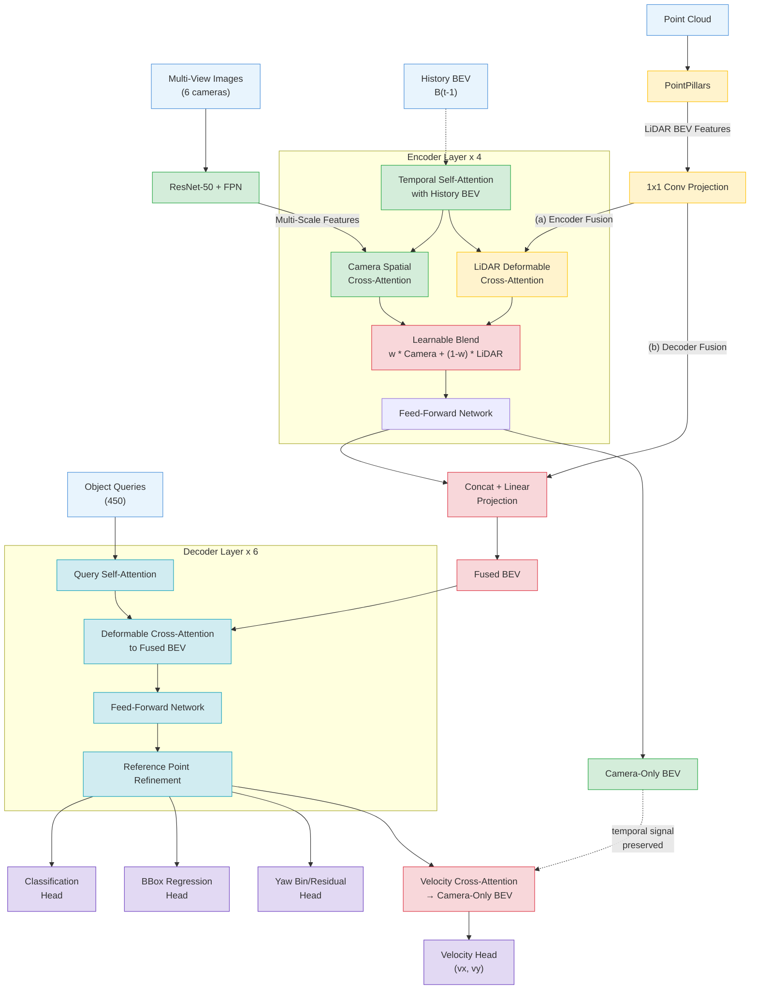

# BEVFormerFusion

Multi-modal 3D object detection fusing camera and LiDAR inputs via BEVFormer with dual encoder-decoder side fusion.

## Architecture

BEVFormerFusion extends BEVFormer with three innovations:

- **Encoder-Side Fusion** -- LiDAR BEV features are injected into every encoder layer via parallel deformable cross-attention, blended with camera cross-attention through a learnable weight
- **Decoder-Side Fusion** -- After the encoder, LiDAR features are concatenated and projected with the BEV embedding before entering the decoder
- **Velocity Head** -- A dedicated cross-attention head that attends to camera-only BEV features (before LiDAR fusion) to predict object velocity, solving the temporal signal dilution problem



## Documentation

Comprehensive technical documentation is organized as a book in the [`doc/`](doc/) folder:

| Chapter | Title | Content |
|---------|-------|---------|
| [00](doc/00-overview.md) | System Overview | Architecture diagrams, design philosophy, chapter guide |
| [01](doc/01-data-pipeline.md) | Data Pipeline | nuScenes dataset, temporal queue, CAN bus, transforms |
| [02](doc/02-camera-branch.md) | Camera Branch | ResNet50 + FPN feature extraction |
| [03](doc/03-lidar-branch.md) | LiDAR Branch | PointPillars: voxelization, pillar features, BEV scatter |
| [04](doc/04-encoder-fusion.md) | Encoder-Side Fusion | TSA, dual SCA, learnable blend weights |
| [05](doc/05-decoder-fusion.md) | Decoder-Side Fusion | Concat+linear fusion, identity initialization |
| [06](doc/06-transformer-decoder.md) | Transformer Decoder | 6-layer decoder, reference point refinement |
| [07](doc/07-detection-heads.md) | Detection Heads | Classification, bbox, yaw bin/res, velocity head |
| [08](doc/08-loss-and-training.md) | Loss & Training | 5 loss functions, gradient isolation, training config |
| [09](doc/09-inference.md) | Inference & Decoding | NMS-free decoding, temporal test-time processing |
| [A](doc/appendix-tensor-shapes.md) | Tensor Shapes | Complete tensor shape reference |
| [B](doc/appendix-file-map.md) | File Map | Key files, class hierarchy |

## Quick Start

```bash
conda activate bev
export PYTHONPATH=.
```

### Train

```bash
python tools/train.py projects/configs/bevformer/bevformer_project.py
```

### Evaluate

```bash
python tools/test.py \
    projects/configs/bevformer/bevformer_project.py \
    work_dirs/bevformer_project/iter_200000.pth \
    --eval bbox
```

### Visualize BEV

```bash
python tools/test.py \
    projects/configs/bevformer/bevformer_project.py \
    work_dirs/bevformer_project/iter_200000.pth \
    --eval bbox \
    --viz-bev --viz-num 20 --viz-score-thr 0.2 \
    --viz-outdir work_dirs/bevformer_project/bev_viz
```

### Resume Training

```bash
python tools/train.py \
    projects/configs/bevformer/bevformer_project.py \
    --resume-from work_dirs/bevformer_project/iter_100000.pth
```

### Monitor

```bash
tensorboard --logdir work_dirs/bevformer_project/tf_logs
```

## Training Configuration

| Parameter | Value |
|-----------|-------|
| Iterations | 200,000 |
| Precision | FP32 |
| Optimizer | AdamW, lr=2e-4, weight_decay=0.01 |
| LR schedule | Cosine annealing, warmup=10K iters |
| Backbone | ResNet50 (frozen stage 1, lr_mult=0.1) |
| BEV size | 100 x 100 |
| Encoder / Decoder layers | 4 / 6 |
| Object queries | 450 |
| Fusion mode | `encoder_decoder` |

See [Chapter 8](doc/08-loss-and-training.md) for full training details.

## Dataset

nuScenes with temporal annotations. 10 classes: car, truck, bus, trailer, construction_vehicle, pedestrian, motorcycle, bicycle, traffic_cone, barrier.

## Requirements

- PyTorch 2.x with CUDA
- mmcv-full 1.7.x
- mmdet 2.28.x
- mmdet3d 1.0.0rc6
- nuscenes-devkit
