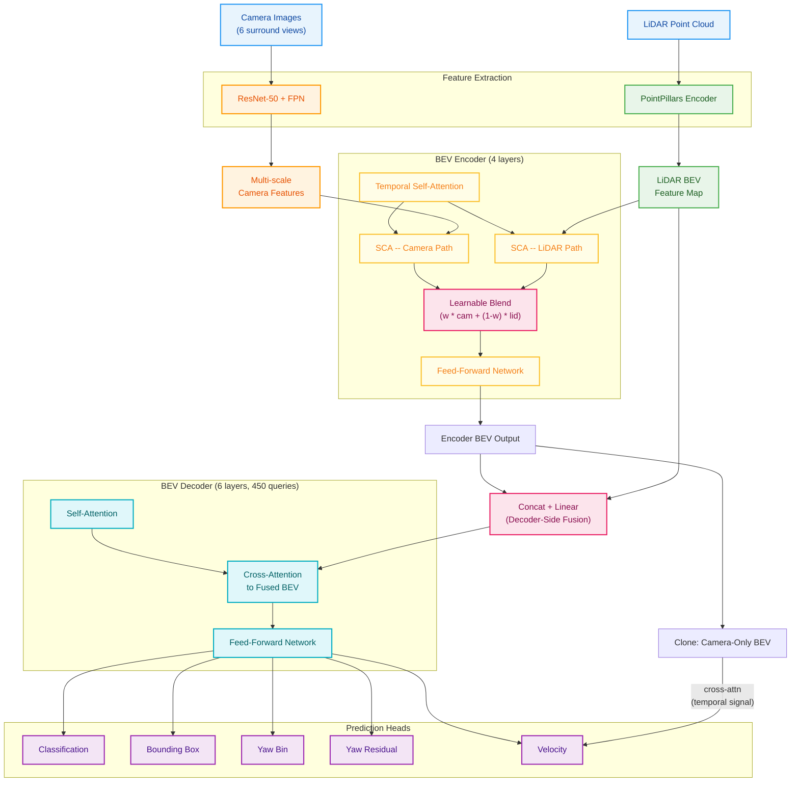
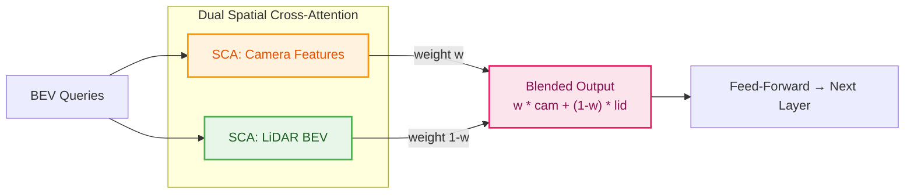
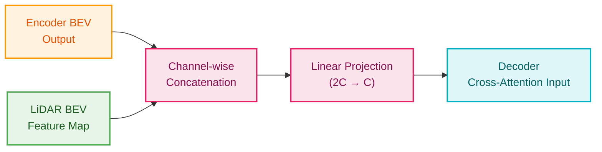
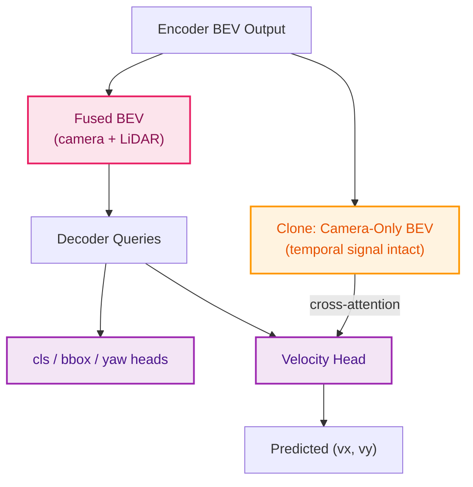
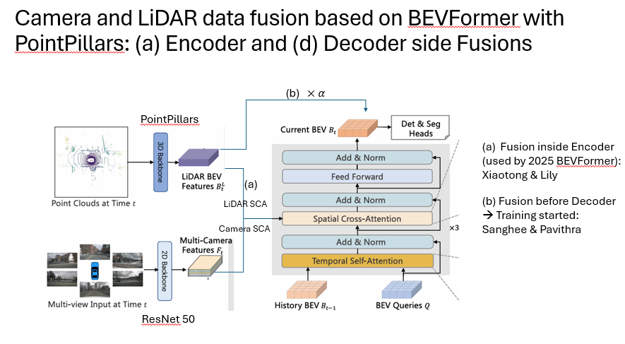

# Chapter 0: System Overview

> **BEVFormerFusion** --- Multi-modal 3D Object Detection via Camera-LiDAR Fusion in BEV Space

---

**Navigation**:
[Ch 0 -- Overview](00-overview.md) |
[Ch 1 -- Data Pipeline](01-data-pipeline.md) |
[Ch 2 -- Camera](02-camera-branch.md) |
[Ch 3 -- LiDAR](03-lidar-branch.md) |
[Ch 4 -- Encoder Fusion](04-encoder-fusion.md) |
[Ch 5 -- Decoder Fusion](05-decoder-fusion.md) |
[Ch 6 -- Decoder](06-transformer-decoder.md) |
[Ch 7 -- Heads](07-detection-heads.md) |
[Ch 7a -- Velocity Head](07a-velocity-head.md) |
[Ch 8 -- Loss & Training](08-loss-and-training.md) |
[Ch 9 -- Inference](09-inference.md) |
[Appendix A](appendix-tensor-shapes.md) |
[Appendix B](appendix-file-map.md)

---

## 1. Introduction

BEVFormer is a transformer-based framework that constructs a unified Bird's-Eye-View (BEV) representation from multi-camera images using spatial cross-attention and temporal self-attention. BEVFormerFusion extends the base architecture with three targeted additions that bring LiDAR into the loop without disrupting the proven camera pipeline.

**Encoder-side fusion.** Inside each BEV encoder layer, a parallel spatial cross-attention (SCA) branch queries the LiDAR BEV feature map alongside the original camera SCA branch. The two outputs are merged through a learnable blending weight, allowing the network to decide how much geometric detail to draw from each modality at every spatial location.

**Decoder-side fusion.** After the encoder produces the BEV embedding, a separate copy of the LiDAR BEV features is concatenated channel-wise with the encoder output. A linear projection compresses the fused representation back to the model dimension, giving the decoder's object queries access to a combined camera-LiDAR scene summary.

**Velocity head.** A dedicated prediction head estimates per-object velocity by cross-attending decoder queries to a *camera-only* clone of the BEV embedding --- one that has not been mixed with LiDAR. This preserves the temporal signal inherent in consecutive camera frames, which is essential for motion estimation and would be diluted by the single-frame LiDAR features.

---

## 2. End-to-End Architecture

The diagram below traces data from raw sensor inputs through feature extraction, BEV construction, fusion, decoding, and final predictions.

---

## 3. Three Innovations

### 3a. Encoder-Side Fusion

Within each of the four encoder layers, spatial cross-attention is executed twice --- once against camera features and once against the LiDAR BEV map. A per-channel learnable weight blends the two results before they enter the feed-forward network.

### 3b. Decoder-Side Fusion

After the encoder, the BEV embedding is enriched with LiDAR information through a simple but effective concatenate-and-project operation. This gives every decoder query access to both modalities.

### 3c. Velocity Head with Camera-Only BEV

Velocity estimation relies on *temporal cues* --- the displacement of objects between consecutive frames. Because LiDAR BEV features capture only the current time step, mixing them into the velocity signal would dilute the frame-to-frame motion information carried by the camera branch. The velocity head therefore cross-attends exclusively to a camera-only clone of the BEV.

---

## 4. Design Philosophy

### Complementary Fusion

Encoder-side fusion operates at *fine granularity*: every BEV grid cell receives blended camera and LiDAR information through parallel cross-attention. Decoder-side fusion operates at *coarse granularity*: the entire BEV map is enriched with LiDAR context via concatenation before the decoder ever sees it. Together, the two stages give the model both local precision and global context from the LiDAR modality.

### Temporal Signal Preservation

BEVFormer's temporal self-attention aligns the current BEV with the previous frame's BEV, encoding object motion implicitly. LiDAR features, captured at a single time step, contain no such inter-frame signal. By routing the velocity head to a camera-only BEV clone, the architecture ensures that temporal displacement information remains undiluted.

### Gradient Isolation

Yaw angle is decomposed into a classification bin and a regression residual, each served by its own head. Velocity gets a dedicated head with its own cross-attention layer. This separation prevents gradient conflicts between fundamentally different tasks --- directional classification, angular regression, and motion regression --- and allows each head to specialize.

---

## 5. Chapter Guide

| Chapter | Title | Description |
|---------|-------|-------------|
| **0** | System Overview | High-level architecture, design philosophy, and chapter roadmap (this document). |
| **1** | Data Flow | End-to-end tensor journey from raw data loading through final predictions. |
| **2** | Backbone & Neck | ResNet-50 + FPN for cameras; PointPillars for LiDAR; feature dimensions. |
| **3** | BEV Encoder | Temporal self-attention, spatial cross-attention, and BEV grid construction. |
| **4** | Encoder-Side Fusion | Dual SCA branches, learnable blending weight, and training dynamics. |
| **5** | Decoder-Side Fusion | Concatenation, linear projection, and how decoder queries consume fused BEV. |
| **6** | Transformer Decoder | 6-layer decoder, reference point refinement, and object queries. |
| **7** | Detection Heads | Classification, bbox regression, yaw (bin + residual), and velocity heads. |
| **7a** | Velocity Head | Dedicated velocity prediction via camera-only BEV cross-attention. |
| **8** | Loss & Training | Per-head losses, weighting strategy, Hungarian matching, and training config. |
| **9** | Inference | NMS-free decoding, temporal test-time processing, and post-processing. |
| **A** | Tensor Shapes | Reference table of key tensor dimensions at every stage. |
| **B** | File Map | Directory structure and mapping from concepts to source files. |

---

## 6. Architecture Reference

The following image provides a consolidated view of the full fusion architecture.

---

*Next: [Chapter 1 -- Data Pipeline](01-data-pipeline.md)*
