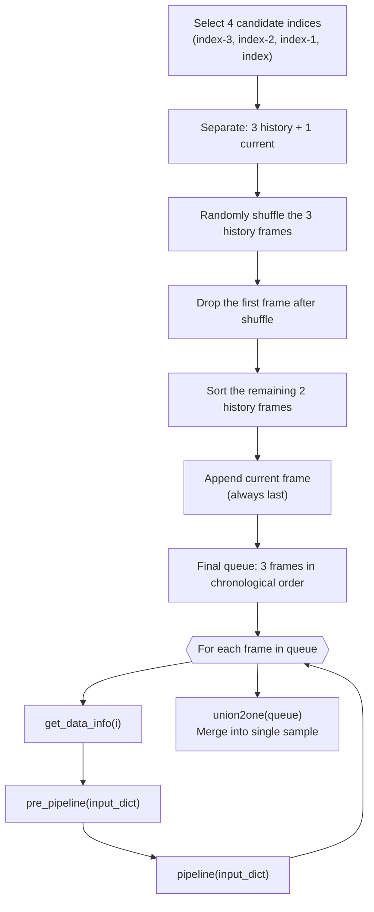
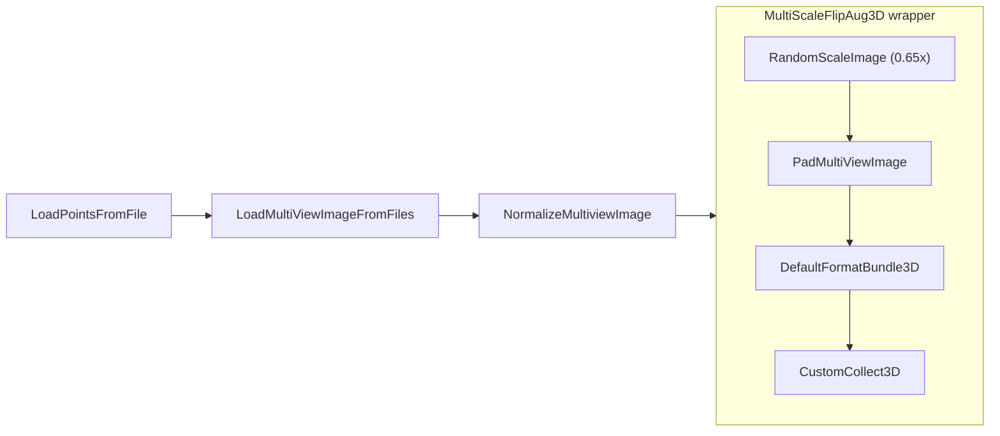

# Chapter 1: Data Pipeline

> [00 Overview](00-overview.md) | **01 Data Pipeline** | [02 Camera](02-camera-branch.md) | [03 LiDAR](03-lidar-branch.md) | [04 Encoder Fusion](04-encoder-fusion.md) | [05 Decoder Fusion](05-decoder-fusion.md) | [06 Decoder](06-transformer-decoder.md) | [07 Heads](07-detection-heads.md) | [07a Velocity Head](07a-velocity-head.md) | [08 Loss & Training](08-loss-and-training.md) | [09 Inference](09-inference.md) | [Appendix A](appendix-tensor-shapes.md) | [Appendix B](appendix-file-map.md)

---

Everything in BEVFormer begins with data. Before any attention layer fires, a carefully orchestrated pipeline loads multi-view images, LiDAR point clouds, and ego-pose metadata, then packages them into the temporal sequences the model expects. This chapter traces that journey from raw nuScenes samples to training-ready tensors.

---

## 1.1 nuScenes Dataset

BEVFormerFusion operates on the [nuScenes](https://www.nuscenes.org/) dataset, performing 3D object detection over **10 classes**:

| # | Class |
|---|-------|
| 0 | car |
| 1 | truck |
| 2 | bus |
| 3 | trailer |
| 4 | construction_vehicle |
| 5 | pedestrian |
| 6 | motorcycle |
| 7 | bicycle |
| 8 | traffic_cone |
| 9 | barrier |

`CustomNuScenesDataset` extends mmdet3d's `NuScenesDataset`, adding camera intrinsics/extrinsics construction, CAN bus enrichment, and the temporal queuing mechanism described next.

---

## 1.2 Temporal Queue Construction

BEVFormer is a video model. Each training sample is not a single frame but a short temporal queue of **4 frames** (3 history + 1 current). The dataset's `prepare_train_data` method builds this queue with a deliberate shuffle-and-drop strategy that provides temporal diversity while keeping chronological order.



**Scene boundary detection.** When `union2one` iterates through the queue, it tracks `scene_token`. If the scene token changes between consecutive frames (meaning a new driving sequence has started), it:

1. Sets `prev_bev_exists = False` so the model knows there is no valid prior BEV to attend to.
2. Resets the ego translation and rotation deltas to zero, preventing nonsensical cross-scene motion vectors.

When frames belong to the same scene, `prev_bev_exists = True` and relative deltas are computed normally.

---

## 1.3 CAN Bus Vector

Each frame carries an 18-dimensional CAN bus vector that encodes ego-vehicle pose. The vector is first populated with **absolute** values in `get_data_info`, then converted to **relative deltas** by `union2one`.

### Layout

| Index | Content | Coordinate Type (before `union2one`) | After `union2one` |
|-------|---------|--------------------------------------|-------------------|
| 0:3 | Ego translation (x, y, z) | Absolute (ego2global) | **Relative delta** from previous frame |
| 3:7 | Ego rotation (quaternion) | Absolute (ego2global) | Unchanged (absolute) |
| 7:16 | Reserved / unused | Zero-filled | Unchanged |
| -2 (16) | Patch angle | Absolute (radians) | Unchanged (absolute) |
| -1 (17) | Patch angle | Absolute (degrees) | **Relative delta** from previous frame |

### How `union2one` converts absolute to relative

For frames within the same scene, `union2one` subtracts the previous frame's values:

- `can_bus[:3] -= prev_pos` -- translation becomes a motion delta.
- `can_bus[-1] -= prev_angle` -- heading angle (degrees) becomes a rotation delta.

At scene boundaries, both are reset to zero. The quaternion at indices 3:7 and the radian angle at index -2 are kept absolute throughout; they are not differenced.

The model's `PerceptionTransformer` later uses these deltas to shift and rotate the previous BEV embedding before temporal self-attention, aligning it with the current frame's coordinate system.

---

## 1.4 Train Pipeline

The training pipeline applies 12 transforms in sequence. Each frame in the temporal queue passes through this pipeline independently before `union2one` merges them.

```mermaid
flowchart LR
    A["LoadPointsFromFile"] --> B["LoadMultiViewImageFromFiles"]
    B --> C["PhotoMetricDistortion"]
    C --> D["LoadAnnotations3D"]
    D --> E["ObjectRangeFilter"]
    E --> F["ObjectNameFilter"]
    F --> G["PointsRangeFilter"]
    G --> H["NormalizeMultiviewImage"]
    H --> I["RandomScaleImage<br/>(0.65x)"]
    I --> J["PadMultiViewImage"]
    J --> K["DefaultFormatBundle3D"]
    K --> L["CustomCollect3D"]
```



| Step | Transform | What It Does |
|------|-----------|--------------|
| 1 | `LoadPointsFromFile` | Loads LiDAR point cloud from `.bin` file (5 dims loaded, 4 used: x, y, z, intensity). |
| 2 | `LoadMultiViewImageFromFiles` | Loads 6 surround-view camera images, converts to `float32`. |
| 3 | `PhotoMetricDistortionMultiViewImage` | Randomly perturbs brightness, contrast, saturation, and hue across all views (data augmentation). |
| 4 | `LoadAnnotations3D` | Loads ground-truth 3D bounding boxes and class labels. |
| 5 | `ObjectRangeFilter` | Removes GT boxes outside the point cloud range ([-51.2, -51.2, -5.0] to [51.2, 51.2, 3.0]). |
| 6 | `ObjectNameFilter` | Keeps only objects belonging to the 10 target classes. |
| 7 | `PointsRangeFilter` | Clips LiDAR points to the point cloud range. |
| 8 | `NormalizeMultiviewImage` | Per-channel normalization (ImageNet mean/std) and BGR-to-RGB conversion. |
| 9 | `RandomScaleImageMultiViewImage` | Resizes all camera images by a fixed scale factor of 0.65 (reduces memory). Also scales `lidar2img` matrices accordingly. |
| 10 | `PadMultiViewImage` | Pads images so spatial dimensions are divisible by 32 (required by the FPN backbone). |
| 11 | `DefaultFormatBundle3D` | Converts numpy arrays to PyTorch tensors and wraps them in `DataContainer`. |
| 12 | `CustomCollect3D` | Selects the final output keys (`points`, `gt_bboxes_3d`, `gt_labels_3d`, `img`) and assembles `img_metas` from meta keys (lidar2img, can_bus, scene_token, etc.). |

---

## 1.5 Test Pipeline

The test pipeline is a simplified version of the training pipeline. It omits all augmentation and GT loading.



Key differences from training:

- No `PhotoMetricDistortion` -- no color augmentation at test time.
- No `LoadAnnotations3D` -- no ground-truth boxes needed.
- No `ObjectRangeFilter`, `ObjectNameFilter`, or `PointsRangeFilter` -- no GT filtering needed.
- Wrapped in `MultiScaleFlipAug3D` for consistent test-time formatting (single scale, no flip).
- `CustomCollect3D` collects only `points` and `img` (no GT keys).

---

## 1.6 Camera Matrix Construction

For the spatial cross-attention in the encoder (Chapter 4), BEV reference points must be projected into each camera's image plane. This requires a `lidar2img` transformation matrix for each of the 6 cameras. These matrices are assembled in `get_data_info`:

```
lidar2cam_r   = inv(sensor2lidar_rotation)          # 3x3
lidar2cam_t   = sensor2lidar_translation @ lidar2cam_r.T  # 1x3
lidar2cam_rt  = [lidar2cam_r.T | -lidar2cam_t]      # 4x4 homogeneous
lidar2img     = cam_intrinsic @ lidar2cam_rt         # 4x4
```

The resulting `lidar2img` matrix maps a 3D point in LiDAR coordinates to a 2D pixel in the camera image (in homogeneous coordinates). A list of 6 such matrices -- one per camera -- is stored in `img_metas['lidar2img']` and travels through the entire pipeline.

When `RandomScaleImageMultiViewImage` resizes the images, it pre-multiplies a scale matrix into `lidar2img` so the projection remains consistent with the resized image dimensions.

---

## 1.7 Key Files

| File | Path | Role |
|------|------|------|
| `nuscenes_dataset.py` | `projects/mmdet3d_plugin/datasets/nuscenes_dataset.py` | `CustomNuScenesDataset` with temporal queue, CAN bus, and camera matrices |
| `loading.py` | `projects/mmdet3d_plugin/datasets/pipelines/loading.py` | Custom data loading transforms |
| `transform_3d.py` | `projects/mmdet3d_plugin/datasets/pipelines/transform_3d.py` | Image normalization, scaling, padding, photometric distortion, `CustomCollect3D` |
| `bevformer_project.py` | `projects/configs/bevformer/bevformer_project.py` | Config file defining train/test pipelines, model, and dataset settings |

---

**Next:** [Chapter 2: Camera Branch](02-camera-branch.md) -- how multi-view images are processed through ResNet-50 and FPN.
