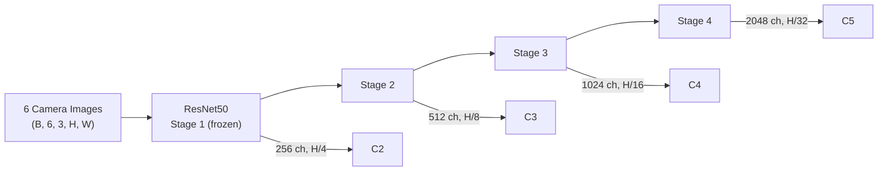
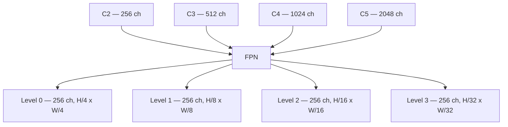

# Chapter 2: Camera Branch

[00 Overview](00-overview.md) | [01 Data Pipeline](01-data-pipeline.md) | **02 Camera Branch** | [03 LiDAR](03-lidar-branch.md) | [04 Encoder Fusion](04-encoder-fusion.md) | [05 Decoder Fusion](05-decoder-fusion.md) | [06 Decoder](06-transformer-decoder.md) | [07 Heads](07-detection-heads.md) | [08 Loss & Training](08-loss-and-training.md) | [09 Inference](09-inference.md) | [Appendix A](appendix-tensor-shapes.md) | [Appendix B](appendix-file-map.md)

---

## Overview

The camera branch extracts visual features from **6 surround-view cameras** and prepares them for the BEV encoder. It consists of two stages:

1. **ResNet50 backbone** -- produces multi-scale feature maps at 4 resolution levels.
2. **FPN neck** -- unifies all levels to a common 256-channel representation.

After FPN, the features are annotated with per-camera and per-level embeddings, then flattened into a single token sequence that the encoder's deformable attention can index.

---

## ResNet50 Backbone

Each of the 6 camera images passes through a shared ResNet50 to produce 4 feature levels at progressively lower resolution and higher channel count.



Key configuration:

| Parameter | Value |
|-----------|-------|
| `depth` | 50 |
| `num_stages` | 4 |
| `out_indices` | (0, 1, 2, 3) |
| `frozen_stages` | 1 (Stage 1 weights are frozen) |
| `lr_mult` | 0.1 for `img_backbone` parameters |
| `norm_cfg` | BatchNorm, `requires_grad=False` |
| `norm_eval` | True (BN stays in eval mode) |
| `pretrained` | `torchvision://resnet50` (ImageNet) |

The combination of `frozen_stages=1`, `lr_mult=0.1`, and frozen BatchNorm means the early layers are essentially fixed feature extractors, while later stages adapt slowly to the 3D detection task.

---

## FPN Neck

The Feature Pyramid Network takes the 4 ResNet levels and produces 4 output levels, all with 256 channels.



| Parameter | Value |
|-----------|-------|
| `in_channels` | [256, 512, 1024, 2048] |
| `out_channels` | 256 |
| `num_outs` | 4 |
| `start_level` | 0 |
| `add_extra_convs` | `'on_output'` |
| `relu_before_extra_convs` | True |

Each FPN output has shape `(B, 6, 256, H_l, W_l)` where `H_l` and `W_l` depend on the level.

---

## Feature Preparation for Encoder

Before the multi-scale features enter the encoder, `PerceptionTransformer.get_bev_features()` performs several preparation steps that are easy to overlook but essential for the deformable attention to work correctly.

### 1. Camera Embeddings

A learned embedding vector is added per camera, giving the network a notion of *which camera* a token came from:

```python
self.cams_embeds = nn.Parameter(torch.Tensor(num_cams, embed_dims))  # (6, 256)
# Added as: feat = feat + cams_embeds[cam_idx]
```

This is critical because the same spatial position in two different cameras corresponds to completely different 3D locations.

### 2. Level Embeddings

A separate learned embedding is added per FPN level, so the network can distinguish which resolution scale a token belongs to:

```python
self.level_embeds = nn.Parameter(torch.Tensor(num_feature_levels, embed_dims))  # (4, 256)
# Added as: feat = feat + level_embeds[lvl]
```

### 3. Spatial Flattening

All FPN levels are flattened into one long token sequence per camera. The spatial dimensions `(H_l, W_l)` from each level are concatenated along the token axis:

```
Level 0: H0*W0 tokens
Level 1: H1*W1 tokens
Level 2: H2*W2 tokens
Level 3: H3*W3 tokens
─────────────────────
Total:   sum(H_l * W_l) tokens per camera
```

The result is a single tensor of shape `(num_cam, B, total_tokens, 256)`.

### 4. Spatial Bookkeeping

Two index tensors are computed so that deformable attention can map back from flattened positions to 2D coordinates within each level:

- **`spatial_shapes`** -- tensor of shape `(num_levels, 2)` storing `(H_l, W_l)` for each level.
- **`level_start_index`** -- tensor of shape `(num_levels,)` with the cumulative start offset of each level in the flattened sequence.

These are passed directly to `MSDeformableAttention3D` in the encoder.

---

## Key Files

| File | Role |
|------|------|
| `projects/configs/bevformer/bevformer_project.py` | Model config: backbone, neck, and all hyperparameters |
| `projects/mmdet3d_plugin/bevformer/detectors/bevformer.py` | `BEVFormer.extract_img_feat()` -- runs backbone + neck |
| `projects/mmdet3d_plugin/bevformer/modules/transformer.py` | `PerceptionTransformer.get_bev_features()` -- feature preparation and encoder call |

---

Next: [Chapter 3: LiDAR Branch (PointPillars)](03-lidar-branch.md)
