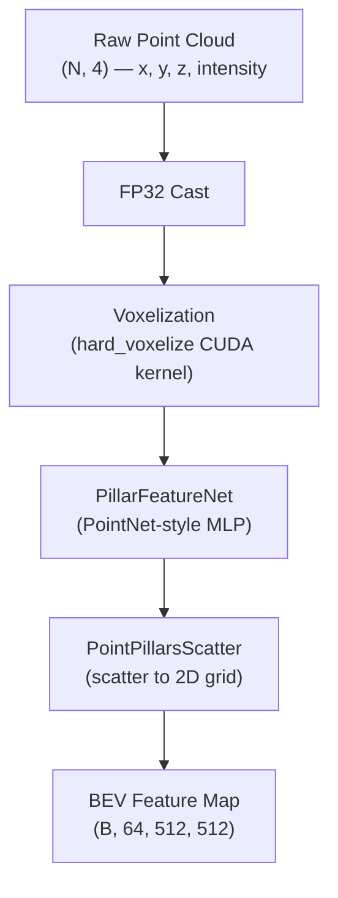

# Chapter 3: LiDAR Branch (PointPillars)

[00 Overview](00-overview.md) | [01 Data Pipeline](01-data-pipeline.md) | [02 Camera](02-camera-branch.md) | **03 LiDAR Branch** | [04 Encoder Fusion](04-encoder-fusion.md) | [05 Decoder Fusion](05-decoder-fusion.md) | [06 Decoder](06-transformer-decoder.md) | [07 Heads](07-detection-heads.md) | [07a Velocity Head](07a-velocity-head.md) | [08 Loss & Training](08-loss-and-training.md) | [09 Inference](09-inference.md) | [Appendix A](appendix-tensor-shapes.md) | [Appendix B](appendix-file-map.md)

---

## Overview

The LiDAR branch converts a raw point cloud into a dense 2D **BEV feature map** using PointPillars. Unlike the camera branch which produces multi-scale features across 6 views, the LiDAR branch outputs a single bird's-eye-view tensor that directly aligns with the BEV grid used by the rest of the model.

This BEV feature map is not used for standalone detection -- it exists solely to be fused with camera features in the encoder and/or decoder stages.

---

## PointPillars Pipeline



Each step:

- **FP32 Cast** -- points are cast to float32 before voxelization to ensure numerical stability in the CUDA kernel.
- **Voxelization** -- bins raw points into vertical pillars on a regular XY grid. Each pillar holds up to 20 points.
- **PillarFeatureNet** -- a small PointNet applied independently to each pillar, producing a single 64-dim feature vector per pillar.
- **PointPillarsScatter** -- places each pillar's feature vector at the correct (x, y) location on a 512x512 grid. Empty pillars are zero-filled.
- **BEV Feature Map** -- the final output is a dense tensor of shape `(B, 64, 512, 512)` covering the full point cloud range.

---

## Voxelization Detail

The voxelization step uses mmdet3d's `hard_voxelize` CUDA kernel (invoked via `Voxelization` in `mmcv.ops`). It assigns each point to a pillar based on its XY coordinates and clips to a maximum number of points per pillar.

| Parameter | Value | Notes |
|-----------|-------|-------|
| `voxel_size` | [0.2, 0.2, 8] | 0.2m XY resolution; single Z bin spans full height |
| `point_cloud_range` | [-51.2, -51.2, -5.0, 51.2, 51.2, 3.0] | 102.4m x 102.4m coverage |
| `max_num_points` | 20 | Points per pillar (excess discarded) |
| `max_voxels` | (30000, 40000) | (train, test) limits on total active pillars |

With `voxel_size=[0.2, 0.2, 8]` and a range of 102.4m in each horizontal axis, the grid is `102.4 / 0.2 = 512` cells in both X and Y. The Z voxel size of 8m means there is effectively one vertical bin -- hence "pillars" rather than full 3D voxels.

Outputs of voxelization:
- **voxels** -- `(num_pillars, max_points, 4)` padded point coordinates per pillar
- **num_points** -- `(num_pillars,)` how many valid points in each pillar
- **coors** -- `(num_pillars, 3)` the (batch_idx, y_idx, x_idx) grid coordinate of each pillar

---

## PillarFeatureNet

PillarFeatureNet applies a PointNet-style operation to each pillar independently:

1. **Augmentation** -- each point's features are augmented with offsets from the pillar center (x - x_c, y - y_c, z - z_c) and optionally the pillar center coordinates themselves.
2. **Linear + BN + ReLU** -- a single-layer MLP maps the augmented features to 64 dimensions.
3. **Max pooling** -- a max operation over all valid points in each pillar produces a single 64-dim vector.

| Parameter | Value |
|-----------|-------|
| `in_channels` | 4 (x, y, z, intensity) |
| `feat_channels` | [64] |
| `with_distance` | False |
| `norm_cfg` | BN1d, eps=1e-3, momentum=0.01 |

The output is a sparse set of pillar features: `(num_pillars, 64)`.

---

## PointPillarsScatter

The scatter module converts the sparse pillar features into a dense 2D pseudo-image. For each pillar, its 64-dim feature vector is placed at the grid location given by `coors`:

```
dense_map[batch, :, y_idx, x_idx] = pillar_feature
```

Locations with no points remain zero. The output shape is `(B, 64, 512, 512)`.

| Parameter | Value |
|-----------|-------|
| `in_channels` | 64 |
| `output_shape` | (512, 512) |

---

## BEV Token Projection

The raw PointPillars output `(B, 64, 512, 512)` cannot be directly fused with camera BEV features, which are 256-dimensional and live on a 100x100 grid. A projection step bridges this gap. The projection is applied in `PerceptionTransformer` and follows the same pattern for both encoder-side and decoder-side fusion:


### Decoder-side projection

For decoder-side fusion, the projected tokens pass through an additional normalization and scaling step before being concatenated with camera BEV tokens:

```python
bev_lidar_tok = F.layer_norm(bev_lidar_tok, (256,))
bev_lidar_tok = bev_lidar_tok * 5.0
```

### The magnitude matching problem

This normalization exists to solve a practical problem: after `Conv2d` projection, the LiDAR token magnitudes are typically much smaller than the camera BEV embeddings produced by the encoder. Without correction, the LiDAR signal would be drowned out during the concatenation-based fusion. The `layer_norm` + `* 5.0` scaling brings LiDAR tokens to roughly the same magnitude as camera tokens, allowing the downstream `lidar_fuse_linear` layer to meaningfully combine both modalities.

The encoder-side path does **not** use this scaling because it fuses via deformable cross-attention rather than concatenation -- the attention mechanism naturally handles differing magnitudes through its learned weights.

### Projection modules by fusion mode

| Fusion Mode | Projection Layer | Extra Normalization |
|-------------|-----------------|---------------------|
| Encoder-side | `lidar_encoder_proj` (Conv2d 64->256) | None |
| Decoder-side | `lidar_proj` (Conv2d 64->256) | LayerNorm + scale by 5.0 |
| Both (`encoder_decoder`) | Separate projection for each path | Decoder path only |

---

## Configuration Table

All PointPillars parameters as configured in `bevformer_project.py`:

| Parameter | Config Key | Value |
|-----------|-----------|-------|
| Voxel size | `pts_voxel_layer.voxel_size` | [0.2, 0.2, 8] |
| Point cloud range | `pts_voxel_layer.point_cloud_range` | [-51.2, -51.2, -5.0, 51.2, 51.2, 3.0] |
| Max points per pillar | `pts_voxel_layer.max_num_points` | 20 |
| Max voxels (train/test) | `pts_voxel_layer.max_voxels` | (30000, 40000) |
| Input channels | `pts_voxel_encoder.in_channels` | 4 (x, y, z, intensity) |
| Feature channels | `pts_voxel_encoder.feat_channels` | [64] |
| Distance feature | `pts_voxel_encoder.with_distance` | False |
| Encoder norm | `pts_voxel_encoder.norm_cfg` | BN1d, eps=1e-3, momentum=0.01 |
| Scatter input channels | `pts_middle_encoder.in_channels` | 64 |
| Scatter output shape | `pts_middle_encoder.output_shape` | (512, 512) |
| Grid size (train_cfg) | `train_cfg.pts.grid_size` | [512, 512, 1] |

---

## Key Files

| File | Role |
|------|------|
| `projects/configs/bevformer/bevformer_project.py` | PointPillars configuration (`pts_voxel_layer`, `pts_voxel_encoder`, `pts_middle_encoder`) |
| `projects/mmdet3d_plugin/bevformer/detectors/bevformer.py` | `BEVFormer.extract_pts_feat()` -- runs the full PointPillars pipeline |
| `projects/mmdet3d_plugin/bevformer/modules/transformer.py` | `PerceptionTransformer` -- contains `lidar_proj`, `lidar_encoder_proj`, and the magnitude scaling logic |
| `mmdet3d/models/voxel_encoders/pillar_encoder.py` | `PillarFeatureNet` implementation |
| `mmdet3d/models/middle_encoders/pillar_scatter.py` | `PointPillarsScatter` implementation |

---

Next: [Chapter 4: Encoder-Side Fusion](04-encoder-fusion.md)
