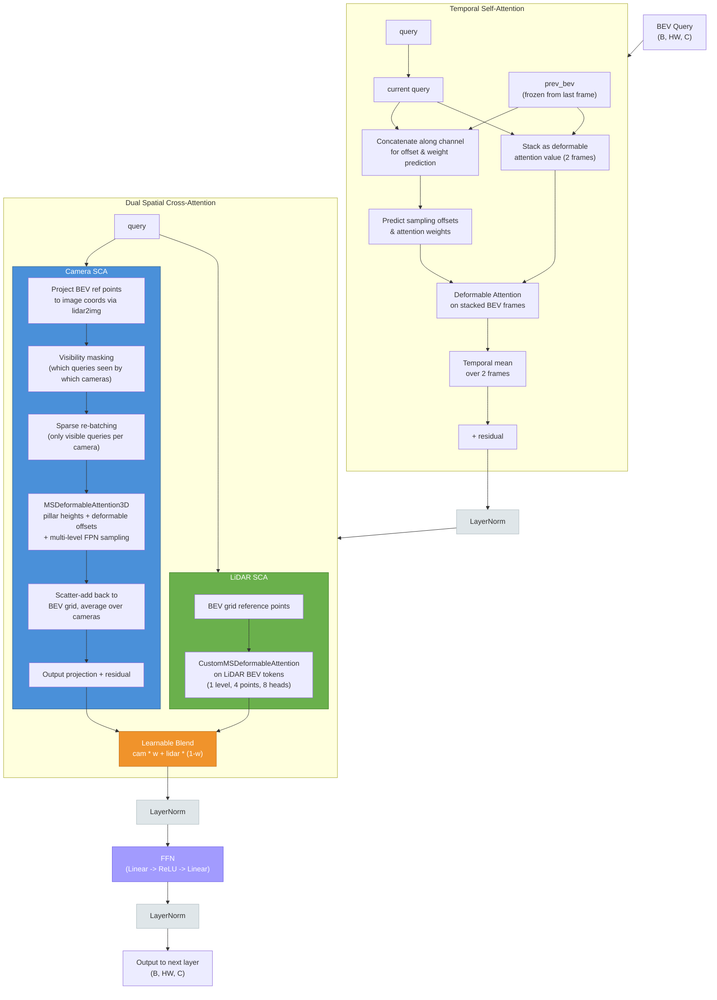
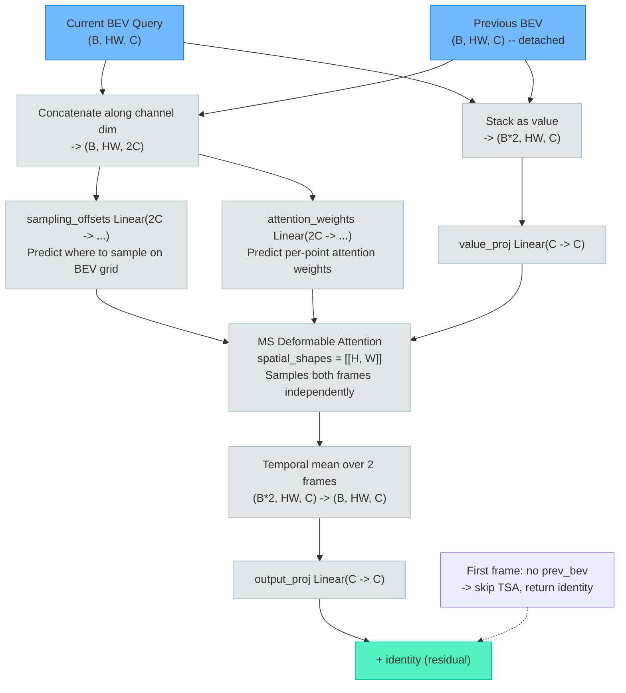
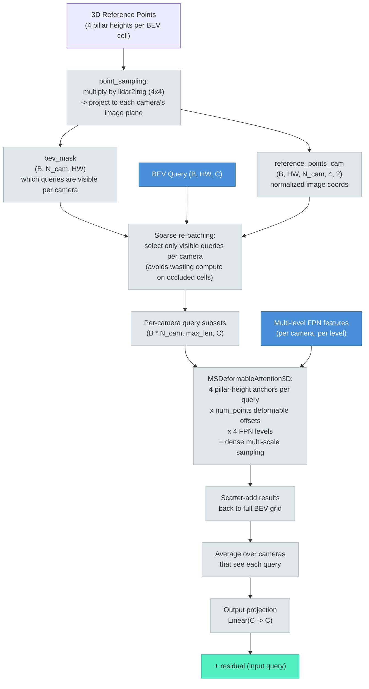
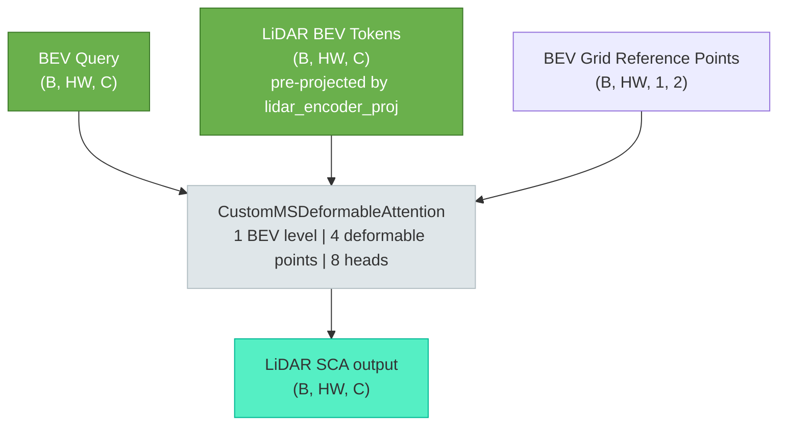
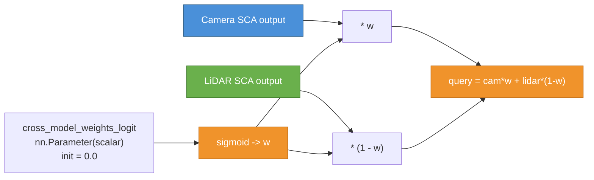
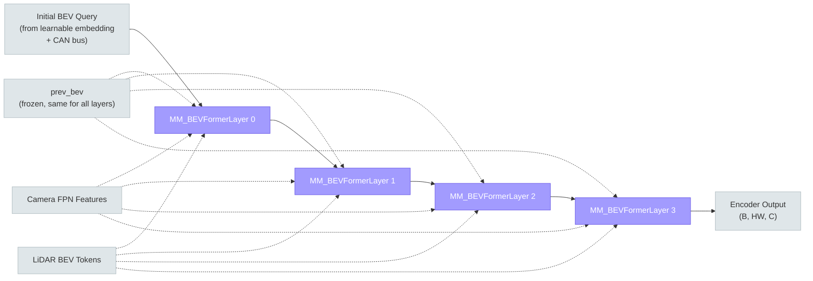

# Chapter 4: Encoder-Side Fusion

> The heart of BEVFormerFusion --- where camera and LiDAR information merge inside the BEV encoder through dual spatial cross-attention and learnable blending.

---

**Navigation**:
[Ch 0 -- Overview](00-overview.md) |
[Ch 1 -- Data Pipeline](01-data-pipeline.md) |
[Ch 2 -- Camera](02-camera-branch.md) |
[Ch 3 -- LiDAR](03-lidar-branch.md) |
[Ch 4 -- Encoder Fusion](04-encoder-fusion.md) |
[Ch 5 -- Decoder Fusion](05-decoder-fusion.md) |
[Ch 6 -- Decoder](06-transformer-decoder.md) |
[Ch 7 -- Heads](07-detection-heads.md) |
[Ch 7a -- Velocity Head](07a-velocity-head.md) |
[Ch 8 -- Loss & Training](08-loss-and-training.md) |
[Ch 9 -- Inference](09-inference.md) |
[Appendix A](appendix-tensor-shapes.md) |
[Appendix B](appendix-file-map.md)

---

## 1. Overview

The BEV encoder consists of **4 stacked layers**, each refining a shared set of BEV queries. In the fusion-enabled configuration, each layer is an instance of `MM_BEVFormerLayer` (as opposed to the camera-only `BEVFormerLayer`). The operation order within every layer is:

```
self_attn -> norm -> cross_attn -> norm -> ffn -> norm
```

which maps to:

1. **Temporal Self-Attention (TSA)** --- align current BEV queries with the previous frame.
2. **LayerNorm**
3. **Dual Spatial Cross-Attention** --- camera SCA and LiDAR SCA run in parallel, then blend.
4. **LayerNorm**
5. **Feed-Forward Network (FFN)**
6. **LayerNorm**

The key difference from vanilla BEVFormer is step 3: instead of a single camera SCA, `MM_BEVFormerLayer` runs two cross-attention branches and merges their outputs with a learnable scalar weight.

---

## 2. Encoder Layer Architecture

The following diagram shows one complete `MM_BEVFormerLayer`. Subgraphs group the three major stages.



---

## 3. Temporal Self-Attention (TSA)

TSA allows BEV queries to look at where objects were in the previous frame, enabling motion-aware features. The first frame of a scene has no history and skips TSA entirely (the query passes through unchanged).



**Key design insight**: The offset and weight prediction networks take `2C`-dimensional input (the concatenation of current and previous BEV features). This allows the network to reason about temporal differences --- if an object moved between frames, the difference in features at that location tells the network where to look in the previous frame.

---

## 4. Camera Spatial Cross-Attention

Camera SCA is the mechanism that lifts 2D image features into the 3D BEV grid. Each BEV query learns to attend to relevant image regions across all cameras.



The sparse re-batching step is critical for efficiency: a rear-facing camera sees at most ~25% of the BEV grid, so processing only visible queries per camera avoids significant wasted computation.

**MSDeformableAttention3D** operates with `num_Z_anchors` (default 4) reference points per query, stacked vertically at different heights along the pillar. For each anchor, the network predicts `num_points` offsets across `num_levels` FPN levels. The total sampling budget per query per camera is `4 heights * num_points * 4 levels`.

---

## 5. LiDAR Spatial Cross-Attention

The LiDAR SCA branch is intentionally simple. Since LiDAR BEV tokens already live in the same BEV coordinate frame as the queries, no 3D-to-2D projection is needed.



Configuration:
- **1 spatial level** (flat BEV grid, no multi-scale)
- **4 deformable sampling points** per head
- **8 attention heads**
- Uses `ref_2d` (the same 2D BEV grid coordinates used by TSA)

The LiDAR BEV tokens are produced upstream in `PerceptionTransformer.get_bev_features` by a `1x1 Conv2d` (`lidar_encoder_proj`) that maps the raw LiDAR BEV feature map (64 channels from the PointPillars backbone) to the model dimension (256), followed by spatial interpolation to match the BEV grid resolution.

---

## 6. Learnable Blend Weight

The outputs of camera SCA and LiDAR SCA are fused with a single learnable scalar per layer:



**Implementation detail** (from `MM_BEVFormerLayer.__init__`):

```python
self.cross_model_weights_logit = nn.Parameter(torch.tensor(0.0), requires_grad=True)
```

At initialization, `sigmoid(0.0) = 0.5`, so both modalities contribute equally. During training, each of the 4 encoder layers learns its own weight independently.

**Design rationale**: This is a minimum-parameter approach to modality blending --- just one scalar per layer (4 total for the encoder). It avoids the risk of overfitting that comes with more complex gating mechanisms while still letting the network learn the optimal balance between camera texture and LiDAR geometry at each depth of the encoder. If the LiDAR branch provides no value for a particular layer, the weight can shift toward `w = 1.0` (camera-only); conversely, layers that benefit from geometric precision can increase the LiDAR contribution.

When `lidar_bev_tokens` is `None` (camera-only inference), the LiDAR branch is skipped entirely and the camera output is used directly without any blending.

---

## 7. BEV Reference Points

The encoder uses two types of reference points, generated once and shared across all 4 layers:

### ref_3d --- Pillar heights for camera SCA

Generated by `BEVFormerEncoder.get_reference_points(dim='3d')`:
- For each BEV cell, create `num_points_in_pillar` (default 4) points spaced evenly along the Z axis.
- Each point is in normalized `[0, 1]` coordinates within the configured `pc_range`.
- These are then projected to image coordinates via `point_sampling`, which applies the `lidar2img` (4x4) transformation matrices to map each 3D point onto each camera's image plane.
- The resulting `reference_points_cam` and `bev_mask` tell camera SCA where to look and which queries are visible.

### ref_2d --- Flat BEV grid for TSA and LiDAR SCA

Generated by `BEVFormerEncoder.get_reference_points(dim='2d')`:
- A simple normalized meshgrid over the BEV plane: `(x, y)` in `[0, 1]`.
- Used as reference points for both Temporal Self-Attention (sampling locations on the BEV grid) and LiDAR SCA (deformable attention anchors).

### point_sampling --- 3D to image projection

The `point_sampling` method:
1. Scales normalized reference points back to metric coordinates using `pc_range`.
2. Appends a homogeneous coordinate (`1`).
3. Multiplies by each camera's `lidar2img` matrix to get pixel coordinates.
4. Normalizes by depth (perspective divide).
5. Creates `bev_mask` by checking which projected points fall within image bounds and have positive depth.

---

## 8. 4-Layer Encoder Loop

The encoder runs the same sequence of operations 4 times. The BEV query is refined progressively, while `prev_bev` remains frozen throughout.



Key points:
- The query output of each layer becomes the query input of the next layer.
- `prev_bev` is the encoder output from the **previous timestep**, detached from the computation graph (no gradient flows back in time).
- Camera FPN features and LiDAR BEV tokens are shared across all layers (computed once upstream).
- Reference points (`ref_2d`, `ref_3d`, `reference_points_cam`, `bev_mask`) are also computed once and reused.

---

## 9. Key Files

| File | Class / Function | Role |
|------|-----------------|------|
| `projects/.../modules/encoder.py` | `BEVFormerEncoder` | Encoder loop: generates reference points, runs 4 layers |
| `projects/.../modules/encoder.py` | `MM_BEVFormerLayer` | Fusion-enabled encoder layer with dual SCA + blend |
| `projects/.../modules/encoder.py` | `BEVFormerLayer` | Camera-only encoder layer (no LiDAR branch) |
| `projects/.../modules/spatial_cross_attention.py` | `SpatialCrossAttention` | Camera SCA: projection, sparse rebatch, scatter-add |
| `projects/.../modules/spatial_cross_attention.py` | `MSDeformableAttention3D` | Inner deformable attention with pillar-height anchors |
| `projects/.../modules/temporal_self_attention.py` | `TemporalSelfAttention` | TSA: temporal deformable attention over BEV frame pairs |
| `projects/.../modules/transformer.py` | `PerceptionTransformer` | Orchestrates encoder + decoder; prepares LiDAR tokens |
| `projects/.../modules/decoder.py` | `CustomMSDeformableAttention` | Deformable attention used by LiDAR SCA branch |

All paths are relative to the repository root under `projects/mmdet3d_plugin/bevformer/`.

---

**Navigation**:
[Ch 0 -- Overview](00-overview.md) |
[Ch 1 -- Data Pipeline](01-data-pipeline.md) |
[Ch 2 -- Camera](02-camera-branch.md) |
[Ch 3 -- LiDAR](03-lidar-branch.md) |
[Ch 4 -- Encoder Fusion](04-encoder-fusion.md) |
[Ch 5 -- Decoder Fusion](05-decoder-fusion.md) |
[Ch 6 -- Decoder](06-transformer-decoder.md) |
[Ch 7 -- Heads](07-detection-heads.md) |
[Ch 7a -- Velocity Head](07a-velocity-head.md) |
[Ch 8 -- Loss & Training](08-loss-and-training.md) |
[Ch 9 -- Inference](09-inference.md) |
[Appendix A](appendix-tensor-shapes.md) |
[Appendix B](appendix-file-map.md)
