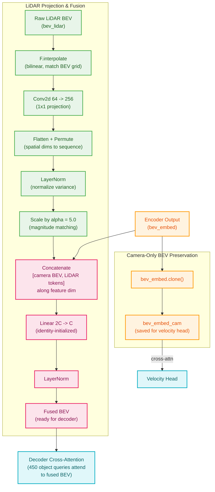
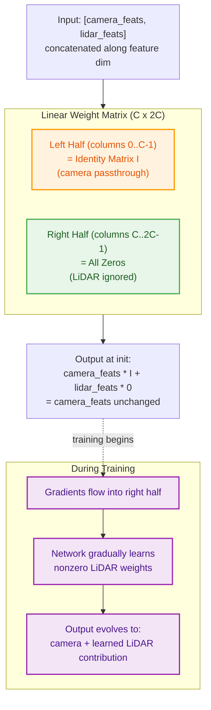
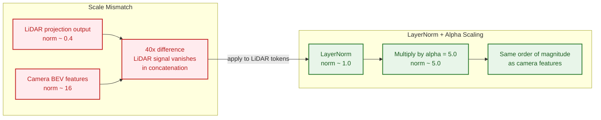

# Chapter 5: Decoder-Side Fusion

---

**Navigation**:
[Ch 0 -- Overview](00-overview.md) |
[Ch 1](01-data-flow.md) |
[Ch 2](02-backbone-neck.md) |
[Ch 3](03-bev-encoder.md) |
[Ch 4](04-encoder-fusion.md) |
[Ch 5](05-decoder-fusion.md) |
[Ch 6](06-prediction-heads.md) |
[Ch 7](07-loss-functions.md) |
[Ch 8](08-training-pipeline.md) |
[Ch 9](09-inference.md) |
[Appendix A -- Tensor Shapes](appendix-tensor-shapes.md) |
[Appendix B -- File Map](appendix-file-map.md)

---

## 1. Overview

After the BEV encoder produces its output, a **second LiDAR injection point** enriches the representation before it reaches the decoder. Where encoder-side fusion ([Chapter 4](04-encoder-fusion.md)) blends LiDAR into BEV queries at every encoder layer through dual spatial cross-attention, decoder-side fusion performs a single **concat + linear projection** operation on the fully-formed encoder output.

The two fusion stages are complementary. Encoder-side fusion provides fine-grained, per-layer refinement. Decoder-side fusion provides a direct LiDAR signal that bypasses the encoder entirely, ensuring that no LiDAR information is lost to iterative processing. When `fusion_mode='encoder_decoder'`, both stages are active simultaneously.

---

## 2. Pipeline Diagram

The following diagram traces the full decoder-side fusion pipeline, from encoder output through to the fused BEV that enters the decoder.



The clone step is critical: `bev_embed_cam` captures the BEV **before** any decoder-side LiDAR mixing. The velocity head cross-attends to this camera-only copy to preserve the temporal motion signal that would otherwise be diluted by single-frame LiDAR features.

---

## 3. Identity Initialization

The fusion linear layer (`lidar_fuse_linear`) maps from 2C dimensions back to C. A naive random initialization would immediately inject noisy LiDAR features into a pipeline that was producing reasonable camera-only BEV representations, destabilizing early training. The solution is **identity initialization**.



The initialization code makes this explicit:

```python
# In init_weights():
self.lidar_fuse_linear.weight.zero_()           # start with all zeros
self.lidar_fuse_linear.weight[:, :C] = torch.eye(C)  # camera half = identity
# lidar half (columns C..2C-1) remains zero
```

At initialization, the linear layer is a **pure passthrough** for camera features. The bias is also zeroed. This means the network begins training as if no decoder-side fusion exists at all --- identical to the camera-only baseline. As gradients flow during training, the right half of the weight matrix gradually develops nonzero values, and the network learns exactly how much LiDAR information to incorporate and in what combination.

This design pattern is sometimes called a "residual gate" or "zero init shortcut." It is especially important here because the encoder output is already a mature, high-quality representation. Disrupting it with random LiDAR noise at the start of training would waste optimization steps recovering lost performance.

---

## 4. Magnitude Matching

Even with identity initialization, there is a subtle problem: the raw LiDAR projections and the camera BEV features live at very different scales.



**Why this matters.** When two feature vectors are concatenated and fed through a linear layer, the layer's gradients are proportional to the input magnitudes. If LiDAR features have norm ~0.4 while camera features have norm ~16, the LiDAR columns of the weight matrix receive gradients roughly 40x smaller than the camera columns. Learning to use LiDAR information becomes extremely slow.

**The two-step fix:**

1. **LayerNorm** normalizes the projected LiDAR tokens to have unit variance (norm ~1.0). This removes the dependence on the raw PointPillars output scale.

2. **Alpha scaling** (constant factor of 5.0) brings the normalized features up to the same order of magnitude as the camera BEV. The value 5.0 was chosen empirically to produce LiDAR norms (~5) that are comparable to, but slightly below, camera norms (~16), ensuring balanced gradient flow without overwhelming the camera signal.

```python
# In forward():
bev_lidar_tok = F.layer_norm(bev_lidar_tok, (bev_lidar_tok.size(-1),))
bev_lidar_tok = bev_lidar_tok * 5.0
```

Note that this normalization is applied **before** concatenation, so the LayerNorm here is independent of the `lidar_fuse_norm` that comes **after** the linear projection.

---

## 5. Comparison: Encoder-Side vs Decoder-Side Fusion

| Aspect | Encoder-Side Fusion | Decoder-Side Fusion |
|--------|-------------------|-------------------|
| **Location** | Inside each encoder layer (applied 4 times) | Once, between encoder and decoder |
| **Mechanism** | Dual SCA with learnable blend weight | Concatenation + linear projection |
| **Initialization** | Standard Xavier (blend weight starts at sigmoid(-2) ~ 0.12) | Identity passthrough (camera = I, LiDAR = 0) |
| **Temporal impact** | Dilutes TSA signal at every layer | Single dilution point after encoder completes |
| **Granularity** | Fine-grained, per-layer refinement through deformable attention | Coarse, single-shot whole-BEV injection |
| **Parameters** | 1 blend scalar per layer + LiDAR projection conv | Linear(2C, C) + LayerNorm + LiDAR projection conv |
| **How LiDAR enters** | Deformable cross-attention queries LiDAR BEV | Direct feature concatenation |

---

## 6. Why Both?

The encoder and decoder fusion stages serve fundamentally different roles, and their combination is more effective than either alone.

**Encoder-side fusion** operates through deformable attention, meaning the BEV queries can selectively attend to relevant spatial locations in the LiDAR feature map. This is powerful for fine-grained geometric detail --- depth ambiguities in camera features can be resolved by attending to nearby LiDAR points. However, because the fusion happens inside the encoder's iterative processing (4 layers of attention, normalization, and feed-forward), some LiDAR signal may be attenuated or transformed beyond recognition by the time the encoder output is produced.

**Decoder-side fusion** bypasses the encoder entirely. The LiDAR BEV features are projected and concatenated directly with the finished encoder output. This provides a "clean" LiDAR signal to the decoder that has not passed through any encoder layers. The decoder's object queries can therefore draw on both the encoder's refined camera-LiDAR blend and the raw, unprocessed LiDAR geometry.

Together, the two stages give the model access to LiDAR information at two levels of abstraction: deeply integrated (encoder) and directly available (decoder). This is analogous to how residual connections in deep networks provide both processed and shortcut signals --- the combination is strictly more expressive than either path alone.

---

## 7. Key Files

| File | Lines | What to look for |
|------|-------|-----------------|
| `projects/mmdet3d_plugin/bevformer/modules/transformer.py` | 53--62 | `fusion_mode` parameter and validation |
| `projects/mmdet3d_plugin/bevformer/modules/transformer.py` | 94--97 | Module definitions: `lidar_proj`, `lidar_fuse_linear`, `lidar_fuse_norm` |
| `projects/mmdet3d_plugin/bevformer/modules/transformer.py` | 160--177 | `init_weights()` --- identity initialization for the fusion linear layer |
| `projects/mmdet3d_plugin/bevformer/modules/transformer.py` | 346 | `bev_embed_cam = bev_embed.clone()` --- camera-only snapshot before fusion |
| `projects/mmdet3d_plugin/bevformer/modules/transformer.py` | 349--364 | Forward pass: LiDAR projection, LayerNorm, alpha scaling, concat, linear fusion |

---

*Previous: [Chapter 4 -- Encoder-Side Fusion](04-encoder-fusion.md)* | *Next: [Chapter 6 -- Prediction Heads](06-prediction-heads.md)*
