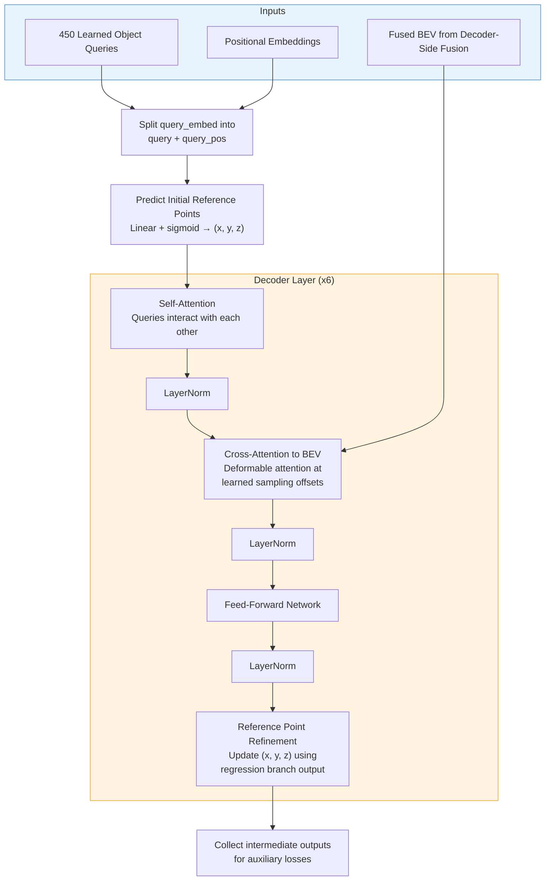
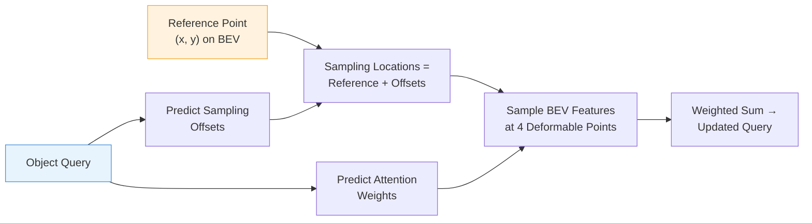
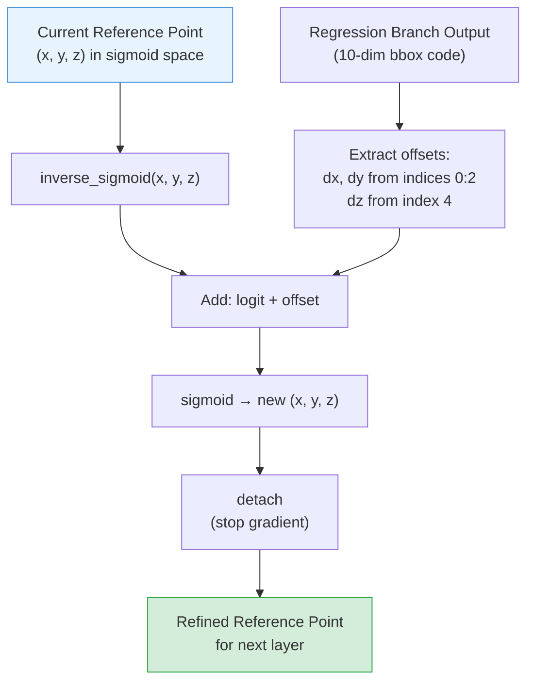
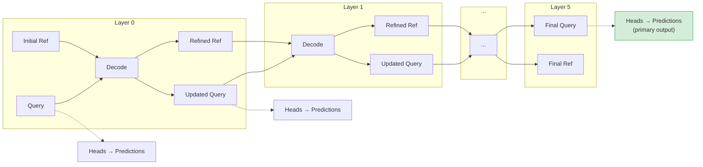

# Chapter 6: Transformer Decoder

[00 Overview](00-overview.md) | [01 Data Pipeline](01-data-pipeline.md) | [02 Camera Branch](02-camera-branch.md) | [03 LiDAR Branch](03-lidar-branch.md) | [04 Encoder Fusion](04-encoder-fusion.md) | [05 Decoder Fusion](05-decoder-fusion.md) | **06 Decoder** | [07 Detection Heads](07-detection-heads.md) | [08 Loss & Training](08-loss-and-training.md) | [09 Inference](09-inference.md) | [Appendix A: Tensors](appendix-tensor-shapes.md) | [Appendix B: Files](appendix-file-map.md)

---

## Overview

The transformer decoder transforms 450 learned object queries into structured 3D detections. Each query represents a candidate object and progressively refines its understanding by cross-attending to the fused BEV representation. The decoder uses 6 iterative layers with reference point refinement -- each layer's output improves the spatial precision of the next.

---

## Decoder Architecture

---

## How One Decoder Layer Works

### 1. Self-Attention

The 450 object queries attend to each other via standard multi-head attention (8 heads, dropout 0.1). This allows queries to reason about relationships between candidate objects -- for example, two nearby queries can coordinate to avoid predicting the same object.

### 2. Cross-Attention to Fused BEV

Each query attends to the BEV feature map using `CustomMSDeformableAttention`:

Key properties:
- **1 spatial level**: the BEV grid (100 x 100)
- **4 deformable sampling points** per query per head
- **8 attention heads**
- Reference points are in normalized BEV coordinates (0 to 1)

### 3. Feed-Forward Network

Standard two-layer MLP: Linear(256, 512) -> ReLU -> Linear(512, 256) with residual connection.

### 4. Reference Point Refinement

After each layer, the regression branch predicts coordinate offsets that refine the reference points:

The `detach()` is critical -- gradients do not flow backward through refined references. Each layer learns to predict accurate outputs given its own reference points, rather than learning to produce offsets that are useful for the next layer.

> **Note**: The z-offset is read from index 4 of the regression output (the `cz` slot), not index 2. This matches the bbox code layout: `[cx, cy, log_w, log_l, cz, log_h, ...]`.

---

## Iterative Refinement Across 6 Layers

All 6 layers produce predictions (via the detection heads in Chapter 7). The last layer provides the primary output; earlier layers provide auxiliary supervision that stabilizes training.

---

## Output

The decoder returns two tensors:

| Output | Shape | Description |
|--------|-------|-------------|
| `inter_states` | (6, B, 450, 256) | Decoder query features at each layer |
| `inter_references` | (6, B, 450, 3) | Refined reference points at each layer (sigmoid space) |

Both are used by the detection heads: `inter_states` feeds all prediction branches, and `inter_references` provides the spatial anchor for bbox coordinate decoding.

---

## Key Files

| File | Path | Role |
|------|------|------|
| `decoder.py` | `bevformer/modules/decoder.py` | `DetectionTransformerDecoder` and `CustomMSDeformableAttention` |
| `transformer.py` | `bevformer/modules/transformer.py` | Decoder invocation within `PerceptionTransformer.forward` |

---

[Next: Chapter 7 - Detection Heads](07-detection-heads.md)
