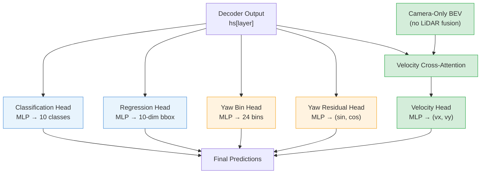
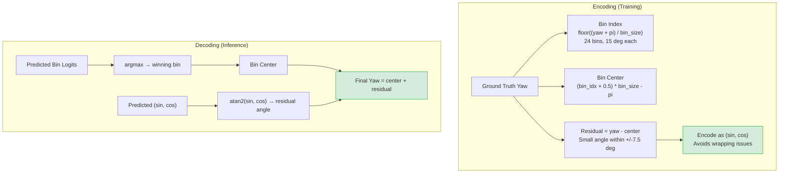
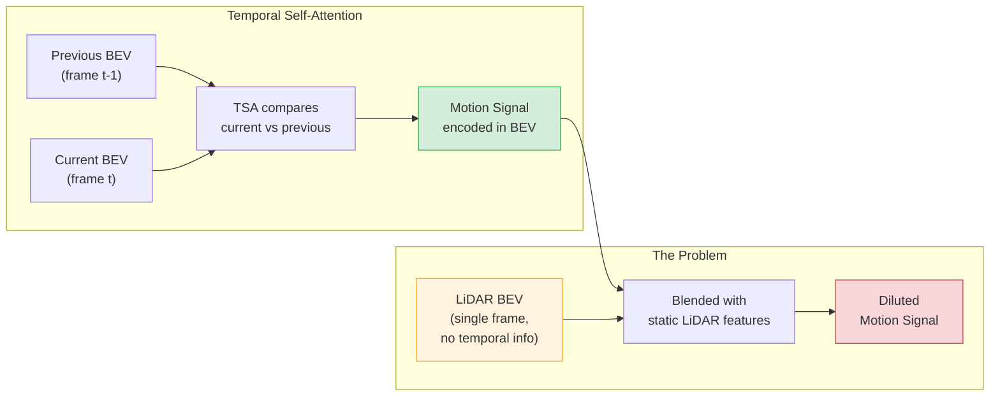
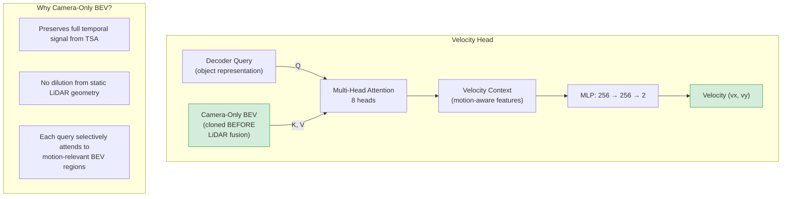
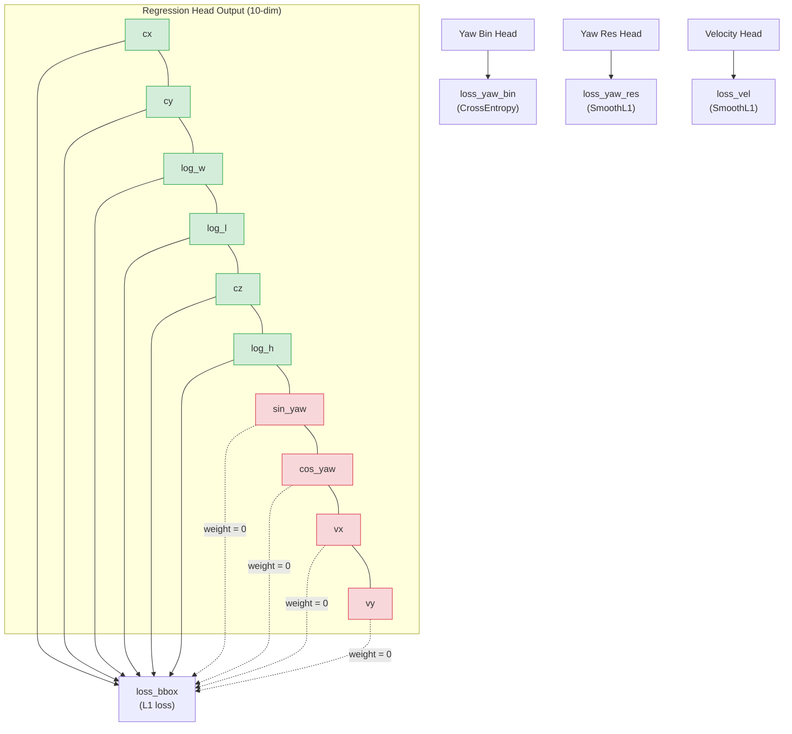

# Chapter 7: Detection Heads

[00 Overview](00-overview.md) | [01 Data Pipeline](01-data-pipeline.md) | [02 Camera Branch](02-camera-branch.md) | [03 LiDAR Branch](03-lidar-branch.md) | [04 Encoder Fusion](04-encoder-fusion.md) | [05 Decoder Fusion](05-decoder-fusion.md) | [06 Decoder](06-transformer-decoder.md) | **07 Detection Heads** | [08 Loss & Training](08-loss-and-training.md) | [09 Inference](09-inference.md) | [Appendix A: Tensors](appendix-tensor-shapes.md) | [Appendix B: Files](appendix-file-map.md)

---

## Overview

Each decoder layer produces a set of predictions through 5 parallel heads. Three of these are novel additions to BEVFormer: the yaw bin/residual heads and the velocity head with camera-only cross-attention.

---

## Head Architecture



### Head Details

| Head | Architecture | Output | Notes |
|------|-------------|--------|-------|
| Classification | Linear+LN+ReLU (x N) -> Linear(256, 10) | Class scores | Focal loss supervision |
| Regression | Linear+ReLU (x N) -> Linear(256, 10) | 10-dim bbox code | Yaw & velocity indices zeroed in loss |
| Yaw Bin | Linear(256,256)+ReLU -> Linear(256, 24) | 24 bin logits | CrossEntropy loss |
| Yaw Residual | Linear(256,256)+ReLU -> Linear(256, 2) | (sin_res, cos_res) | SmoothL1 loss |
| Velocity | CrossAttn + Linear(256,256)+ReLU -> Linear(256, 2) | (vx, vy) | Camera-only BEV input |

All heads are cloned per decoder layer (6 independent copies each), enabling auxiliary supervision.

---

## BBox Code Layout

The regression head outputs a 10-dimensional vector with this fixed layout:

| Index | Symbol | Encoding | Supervised By |
|-------|--------|----------|---------------|
| 0 | cx | sigmoid + pc_range scaling | `reg_branches` |
| 1 | cy | sigmoid + pc_range scaling | `reg_branches` |
| 2 | log(w) | log-space width | `reg_branches` |
| 3 | log(l) | log-space length | `reg_branches` |
| 4 | cz | sigmoid + pc_range scaling | `reg_branches` |
| 5 | log(h) | log-space height | `reg_branches` |
| 6 | sin(yaw) | unit-circle normalized | `yaw_bin/res_branches` only |
| 7 | cos(yaw) | unit-circle normalized | `yaw_bin/res_branches` only |
| 8 | vx | direct | `vel_branches` only |
| 9 | vy | direct | `vel_branches` only |

Indices 6-9 are **overwritten at inference** by the dedicated yaw and velocity heads. During training, their loss weights in `bbox_weights` are set to zero to prevent conflicting gradients.

---

## Yaw Bin/Residual Head

### The Problem with Direct Yaw Regression

Yaw angles have a wrapping discontinuity at +/-pi. A small angular change near the boundary causes a huge regression target jump, destabilizing gradients.

### The Bin + Residual Solution



**Why this works**: The bin classification handles coarse orientation (no wrapping issues with cross-entropy), while the residual regression handles fine-grained correction within a narrow +/-7.5 degree range using sin/cos encoding.

### Sin/Cos Normalization in Regression Head

The regression branch also outputs sin/cos at indices 6-7. These are stabilized during training:

```python
sc = reg_output[..., 6:8].tanh()                        # clamp to (-1, 1)
sc = sc / (sc.norm(dim=-1, keepdim=True) + 1e-7)        # project onto unit circle
```

This prevents the sin/cos pair from drifting off the unit circle during early training.

---

## Velocity Head

The velocity head is the key innovation for maintaining accurate motion prediction despite LiDAR fusion.

### The Temporal Dilution Problem



### The Solution: Camera-Only Cross-Attention



**Key design choices**:

1. **Camera-only BEV**: `bev_embed_cam` is cloned before decoder-side LiDAR fusion, preserving the full temporal motion signal from TSA
2. **Full attention** (not deformable): `nn.MultiheadAttention` allows each query to attend over the entire BEV grid, important for capturing motion patterns that may span large regions
3. **Per-layer**: One cross-attention + MLP per decoder layer, receiving the progressively refined query

---

## Gradient Isolation

A critical design pattern ensures each specialized head receives exclusive supervision:



By zeroing `bbox_weights` at indices 6-9, the regression head receives no gradient for yaw or velocity. All yaw learning flows through the bin + residual heads, and all velocity learning flows through the camera-only cross-attention head.

---

## Key Files

| File | Path | Role |
|------|------|------|
| `bevformer_head.py` | `bevformer/dense_heads/bevformer_head.py` | All prediction heads, velocity cross-attention, loss computation |
| `util.py` | `core/bbox/util.py` | `normalize_bbox`, `denormalize_bbox`, yaw bin encode/decode |

---

[Next: Chapter 8 - Loss Functions & Training](08-loss-and-training.md)
