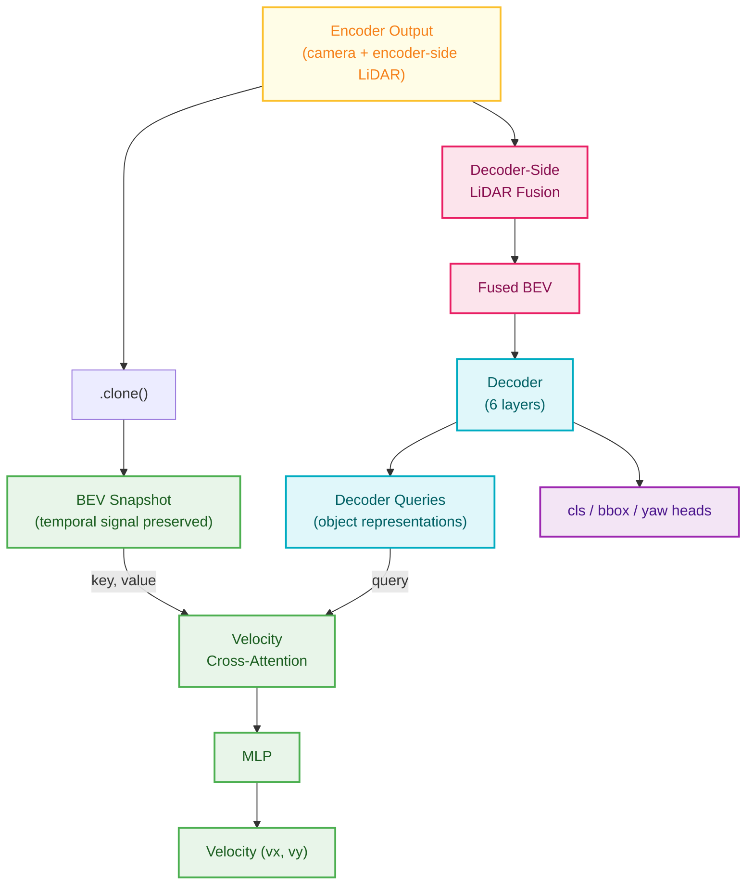
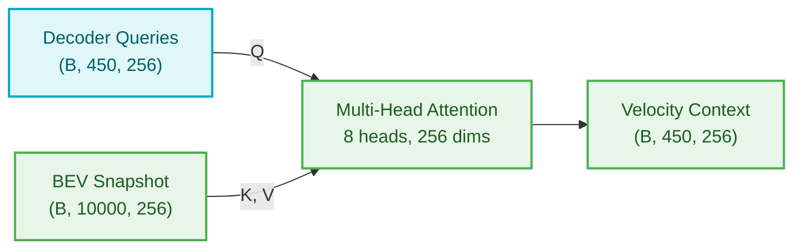
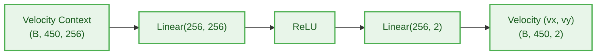
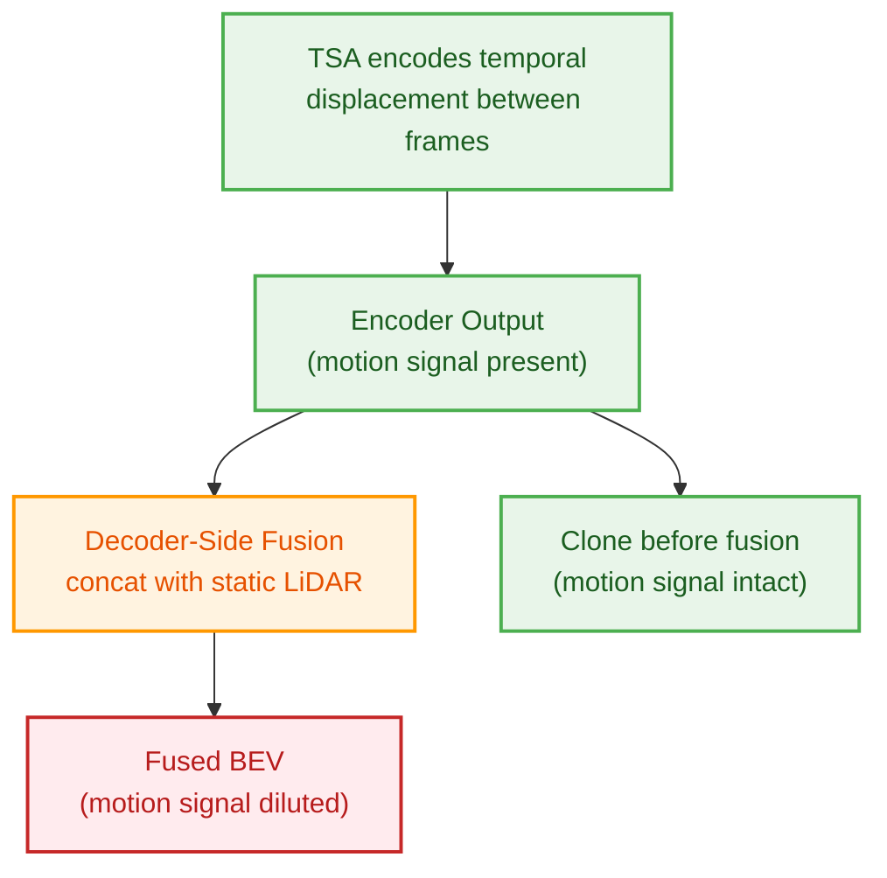
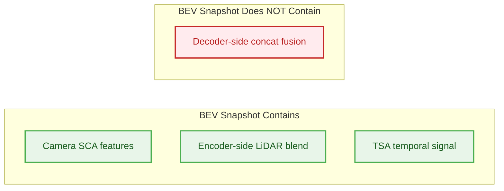

# Chapter 7a: Velocity Head

---

**Navigation**:
[Ch 0 -- Overview](00-overview.md) |
[Ch 1 -- Data Pipeline](01-data-pipeline.md) |
[Ch 2 -- Camera](02-camera-branch.md) |
[Ch 3 -- LiDAR](03-lidar-branch.md) |
[Ch 4 -- Encoder Fusion](04-encoder-fusion.md) |
[Ch 5 -- Decoder Fusion](05-decoder-fusion.md) |
[Ch 6 -- Decoder](06-transformer-decoder.md) |
[Ch 7 -- Heads](07-detection-heads.md) |
**Ch 7a -- Velocity Head** |
[Ch 8 -- Loss & Training](08-loss-and-training.md) |
[Ch 9 -- Inference](09-inference.md) |
[Appendix A](appendix-tensor-shapes.md) |
[Appendix B](appendix-file-map.md)

---

## 1. What Is the Velocity Head

The velocity head is a dedicated post-decoder prediction module that estimates per-object velocity. It is not part of the encoder or the decoder --- it is a **consumer** that reads from both stages without modifying either.

It exists to solve one specific problem: the decoder operates on a BEV that has been heavily injected with single-frame LiDAR features (via decoder-side fusion), which is excellent for spatial detection but drowns out the temporal motion signal. The velocity head bypasses this by reading from an earlier BEV snapshot where the temporal displacement signal from Temporal Self-Attention is still prominent.

---

## 2. Where It Sits in the Pipeline

The velocity head bridges the encoder and decoder stages. It reads from two sources and produces one output.



The BEV snapshot is cloned **before** decoder-side LiDAR fusion modifies the encoder output. This is the critical design point: the snapshot retains the temporal motion signal from TSA that consecutive BEV frame comparison produced.

---

## 3. How It Works

The velocity head consists of two stages, each instantiated independently for all 6 decoder layers.

### Stage 1: Cross-Attention



Standard multi-head attention (not deformable). Each of the 450 object queries attends over the full 10,000-token BEV to gather motion-relevant context at its spatial location. Full attention is used instead of deformable attention because motion patterns may span large spatial regions.

### Stage 2: MLP



A simple two-layer network maps the enriched query to a 2D velocity vector.

---

## 4. Why a Separate Head

### The Temporal Dilution Problem

Velocity is a temporal signal. It emerges from TSA comparing the current BEV with the previous frame's BEV --- after ego-motion compensation, any residual spatial displacement between frames encodes object-level motion. A single-frame LiDAR point cloud contains no such information.



Decoder-side fusion concatenates strong LiDAR spatial features with the BEV, which benefits position and size prediction but overwhelms the subtle temporal displacement signal. The velocity head avoids this by reading from the pre-fusion clone.

### Three Design Decisions

1. **Separate BEV source** --- reads from the BEV snapshot taken before decoder-side LiDAR fusion, where the temporal signal is stronger
2. **Dedicated parameters** --- own cross-attention and MLP weights per decoder layer, no parameter sharing with bbox regression
3. **Gradient isolation** --- the velocity channels (indices 8-9) in the bbox regression output have their loss weights zeroed; velocity is trained exclusively through this head

---

## 5. Training

| Parameter | Value |
|---|---|
| Loss function | SmoothL1 (Huber loss) |
| Loss weight | 0.25 |
| Supervision scope | Positive (matched) queries only |
| BBox velocity weight | 0 (fully isolated) |
| Copies | 6 (one per decoder layer, with auxiliary supervision) |

The velocity loss is computed only on positive queries that have finite ground-truth velocity values. Background queries are excluded. The last decoder layer's loss carries full weight; intermediate layers provide auxiliary supervision to stabilize training.

---

## 6. Inference

At inference time, the velocity head's output replaces the untrained velocity channels in the bbox prediction. The bbox regression branch outputs a 10-dimensional vector that includes velocity slots at indices 8-9, but these are never supervised during training. The NMS-free bbox coder overwrites them:

```
bbox_preds[..., 8:10] = vel_preds
```

This happens before denormalization, so the velocity values pass through the same coordinate transformation as the rest of the bbox.

---

## 7. What "Camera-Only BEV" Actually Contains

The BEV snapshot is called "camera-only" in the codebase, but this is relative to decoder-side fusion only. In reality, the snapshot has already passed through:

1. **4 encoder layers** of dual SCA with encoder-side LiDAR blending (where the model learned ~60-74% LiDAR influence)
2. **4 rounds of TSA** comparing current and previous BEV frames

So the snapshot contains both camera and encoder-side LiDAR information, plus the temporal motion signal. What it does **not** contain is the decoder-side concat fusion --- the direct, high-bandwidth LiDAR injection that would dominate the representation.



---

## 8. Key Files

| File | Location | Role |
|---|---|---|
| `bevformer_head.py` | `_init_layers()` | Defines `vel_cross_attn` (ModuleList of MultiheadAttention) and `vel_branches` (ModuleList of MLP) |
| `bevformer_head.py` | `forward()` | Runs velocity cross-attention + MLP at each decoder layer |
| `bevformer_head.py` | `loss_single()` | Computes SmoothL1 velocity loss on positive queries only |
| `transformer.py` | `forward()` | Clones BEV snapshot before decoder-side fusion, returns it as 5th output |
| `nms_free_coder.py` | `decode_single()` | Overwrites bbox velocity channels with velocity head predictions at inference |

---

*Previous: [Chapter 7 -- Detection Heads](07-detection-heads.md)* | *Next: [Chapter 8 -- Loss & Training](08-loss-and-training.md)*
