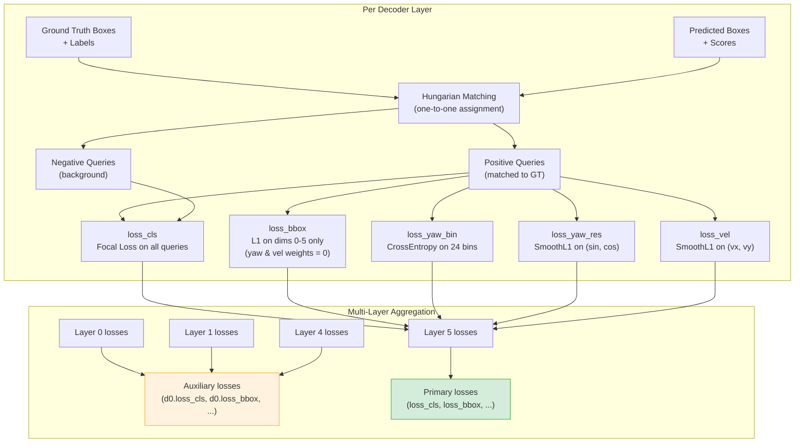
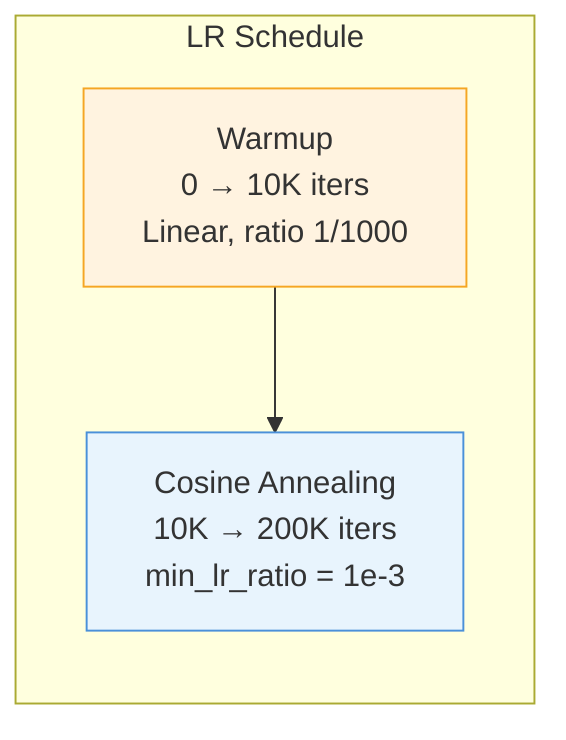
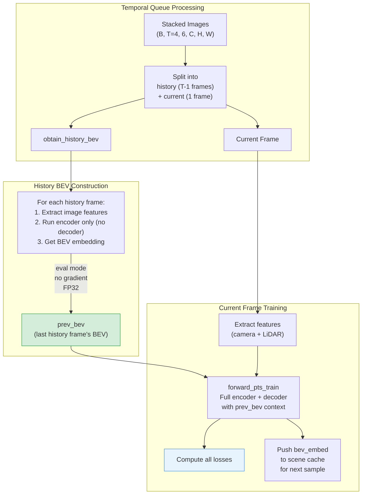

# Chapter 8: Loss Functions & Training

[00 Overview](00-overview.md) | [01 Data Pipeline](01-data-pipeline.md) | [02 Camera Branch](02-camera-branch.md) | [03 LiDAR Branch](03-lidar-branch.md) | [04 Encoder Fusion](04-encoder-fusion.md) | [05 Decoder Fusion](05-decoder-fusion.md) | [06 Decoder](06-transformer-decoder.md) | [07 Detection Heads](07-detection-heads.md) | **08 Loss & Training** | [09 Inference](09-inference.md) | [Appendix A: Tensors](appendix-tensor-shapes.md) | [Appendix B: Files](appendix-file-map.md)

---

## Overview

Training combines five loss functions with Hungarian matching, auxiliary decoder losses, and careful gradient isolation. The system runs in full FP32 precision for maximum numerical stability.

---

## Loss Components

| Loss | Type | Weight | Scope | Description |
|------|------|--------|-------|-------------|
| `loss_cls` | Focal Loss | 2.0 | All 450 queries | 10-class classification with background suppression |
| `loss_bbox` | L1 Loss | 0.25 | Positive queries | 10-dim bbox regression (yaw & velocity zeroed) |
| `loss_yaw_bin` | Cross Entropy | 0.2 | Positive queries | 24-bin yaw classification |
| `loss_yaw_res` | Smooth L1 | 0.2 | Positive queries | (sin, cos) residual regression |
| `loss_vel` | Smooth L1 | 0.25 | Positive queries | (vx, vy) from camera-only velocity head |

---

## Loss Computation Flow



### Gradient Isolation Detail

The bbox regression loss operates on all 10 dimensions, but indices 6-9 have their loss weights zeroed:

```python
bbox_weights[:, 6] = 0.0   # sin(yaw) -- yaw_bin/res heads only
bbox_weights[:, 7] = 0.0   # cos(yaw) -- yaw_bin/res heads only
bbox_weights[:, 8] = 0.0   # vx -- velocity head only
bbox_weights[:, 9] = 0.0   # vy -- velocity head only
```

This ensures that yaw is exclusively supervised through the bin + residual heads, and velocity is exclusively supervised through the camera-only cross-attention head.

---

## Hungarian Matching

Assignment uses `HungarianAssigner3D` to find the optimal one-to-one matching between predictions and ground truth:

| Matching Cost | Type | Weight |
|---------------|------|--------|
| Classification | Focal Loss Cost | 2.0 |
| Bbox regression | BBox3D L1 Cost | 0.25 |
| IoU | IoU Cost | 0.25 |

The matching is performed independently per decoder layer (since predictions differ across layers).

---

## Auxiliary Losses

All 6 decoder layers produce predictions, but they serve different roles:

| Layers 0-4 | Layer 5 |
|-------------|---------|
| Auxiliary supervision | Primary supervision |
| Prefixed: `d0.loss_cls`, `d1.loss_bbox`, ... | Keys: `loss_cls`, `loss_bbox`, ... |
| Same weights as primary | Standard weights |
| Stabilize training of earlier layers | Drives final detection quality |

---

## Training Configuration

### Optimizer

| Parameter | Value |
|-----------|-------|
| Type | AdamW |
| Learning rate | 2e-4 |
| Weight decay | 0.01 |
| Backbone lr multiplier | 0.1 (slower learning for pretrained ResNet50) |
| Gradient clipping | max_norm = 1.0 |

### Learning Rate Schedule



### General Settings

| Parameter | Value |
|-----------|-------|
| Total iterations | 200,000 |
| Precision | FP32 (full) |
| Batch size | 1 per GPU |
| Workers per GPU | 6 |
| Eval interval | every 20K iterations |
| Checkpoint interval | every 20K iterations (keep 5) |
| Speed | ~0.39 s/iter |
| GPU memory | ~8.9 GB |

---

## Temporal BEV Memory During Training

Training uses a temporal queue of 4 frames to build the `prev_bev` context:



**Key details**:
- History frames are processed in **eval mode** with **no gradient** to save memory
- If the scene changes between frames, `prev_bev` is set to `None`
- The BEV embedding is cached per-scene for cross-sample temporal continuity

---

## Key Files

| File | Path | Role |
|------|------|------|
| `bevformer_head.py` | `bevformer/dense_heads/bevformer_head.py` | `loss_single()` and `loss()` methods |
| `bevformer.py` | `bevformer/detectors/bevformer.py` | `forward_train()`, `obtain_history_bev()` |
| `bevformer_project.py` | `configs/bevformer/bevformer_project.py` | All training hyperparameters |
| `hungarian_assigner_3d.py` | `core/bbox/assigners/hungarian_assigner_3d.py` | Hungarian matching |

---

[Next: Chapter 9 - Inference & Decoding](09-inference.md)
