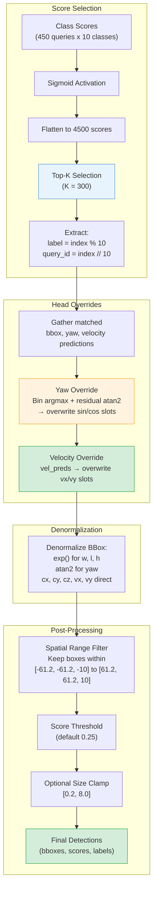
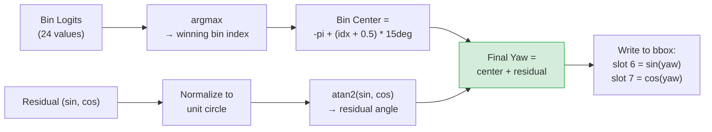
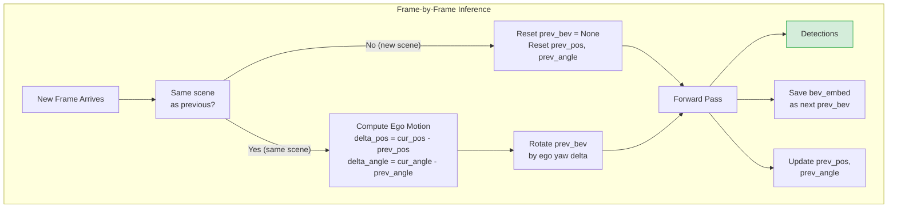

# Chapter 9: Inference & Decoding

[00 Overview](00-overview.md) | [01 Data Pipeline](01-data-pipeline.md) | [02 Camera Branch](02-camera-branch.md) | [03 LiDAR Branch](03-lidar-branch.md) | [04 Encoder Fusion](04-encoder-fusion.md) | [05 Decoder Fusion](05-decoder-fusion.md) | [06 Decoder](06-transformer-decoder.md) | [07 Detection Heads](07-detection-heads.md) | [07a Velocity Head](07a-velocity-head.md) | [08 Loss & Training](08-loss-and-training.md) | **09 Inference** | [Appendix A: Tensors](appendix-tensor-shapes.md) | [Appendix B: Files](appendix-file-map.md)

---

## Overview

Inference uses NMS-free decoding: the top-K scoring queries are selected, their yaw and velocity slots are overwritten by the dedicated heads, bounding boxes are denormalized, and spatial filtering is applied. No Non-Maximum Suppression is needed because the DETR-style Hungarian matching already ensures one-to-one query-to-object assignment during training.

---

## Decoding Pipeline



---

## Yaw Decoding Detail

The yaw angle is reconstructed from the bin classification and residual regression:



## Velocity Override

Simple replacement: the velocity head's output directly overwrites the regression branch's velocity slots:

```
bbox_preds[..., 8:10] = vel_preds    # (vx, vy) from camera-only BEV head
```

---

## Test-Time Temporal Processing

During inference, the system maintains temporal context across frames within a scene:



**Key details**:
- Scene token tracking detects scene boundaries (new sequence = reset temporal state)
- `prev_bev` is rotated to compensate for ego-vehicle yaw change using `torchvision.transforms.functional.rotate`
- CAN bus provides the relative ego-motion delta (translation and yaw)
- When `prev_bev` is None (first frame or new scene), TSA is skipped and the system operates in single-frame mode

---

## Inference Configuration

| Parameter | Value |
|-----------|-------|
| Score threshold | 0.25 |
| Max detections | 300 |
| Post-center range | [-61.2, -61.2, -10.0, 61.2, 61.2, 10.0] |
| NMS | None (NMS-free) |
| Video test mode | True (carry prev_bev across frames) |

---

## Why NMS-Free?

The DETR-style decoder with Hungarian matching trains each query to specialize in detecting one object. Unlike anchor-based detectors that produce many overlapping proposals for each object, the one-to-one matching ensures queries learn non-overlapping responsibilities. At inference, simple top-K selection is sufficient.

---

## Key Files

| File | Path | Role |
|------|------|------|
| `nms_free_coder.py` | `core/bbox/coders/nms_free_coder.py` | `decode_single()`: top-K, yaw/vel override, denormalize |
| `util.py` | `core/bbox/util.py` | `denormalize_bbox()`, `overwrite_sincos_from_bins()` |
| `bevformer.py` | `bevformer/detectors/bevformer.py` | `forward_test()`, `simple_test()`: temporal state management |

---

[Next: Appendix A - Tensor Shape Reference](appendix-tensor-shapes.md)
