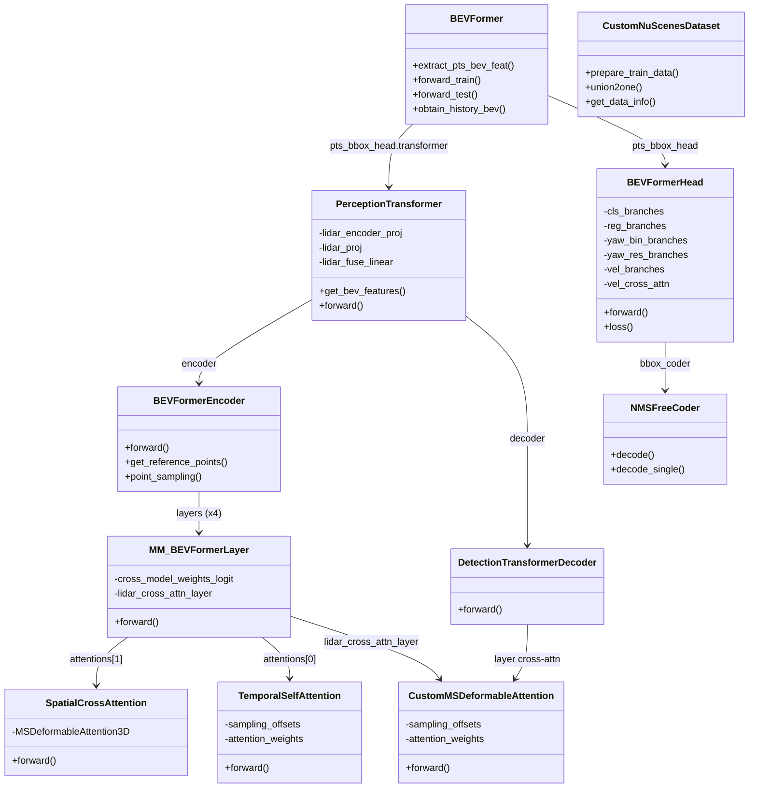
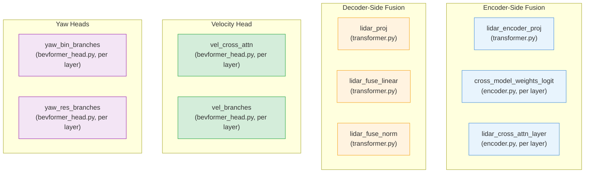

# Appendix B: File Map & Class Hierarchy

[00 Overview](00-overview.md) | [01 Data Pipeline](01-data-pipeline.md) | [02 Camera Branch](02-camera-branch.md) | [03 LiDAR Branch](03-lidar-branch.md) | [04 Encoder Fusion](04-encoder-fusion.md) | [05 Decoder Fusion](05-decoder-fusion.md) | [06 Decoder](06-transformer-decoder.md) | [07 Detection Heads](07-detection-heads.md) | [07a Velocity Head](07a-velocity-head.md) | [08 Loss & Training](08-loss-and-training.md) | [09 Inference](09-inference.md) | [Appendix A: Tensors](appendix-tensor-shapes.md) | **Appendix B: Files**

---

## Key Files

All paths are relative to `projects/mmdet3d_plugin/` unless otherwise noted.

| File | Role | Chapter |
|------|------|---------|
| `bevformer/detectors/bevformer.py` | Top-level detector: LiDAR branch (PointPillars), temporal BEV memory, train/test orchestration | [03](03-lidar-branch.md), [08](08-loss-and-training.md) |
| `bevformer/modules/transformer.py` | `PerceptionTransformer`: BEV construction, encoder/decoder-side fusion, `bev_embed_cam` creation | [04](04-encoder-fusion.md), [05](05-decoder-fusion.md) |
| `bevformer/modules/encoder.py` | `BEVFormerEncoder` + `MM_BEVFormerLayer`: encoder loop, dual SCA, learnable blend weights | [04](04-encoder-fusion.md) |
| `bevformer/modules/spatial_cross_attention.py` | `SpatialCrossAttention` + `MSDeformableAttention3D`: camera cross-attention with sparse re-batching | [04](04-encoder-fusion.md) |
| `bevformer/modules/temporal_self_attention.py` | `TemporalSelfAttention`: prev/cur BEV temporal fusion via deformable attention | [04](04-encoder-fusion.md) |
| `bevformer/modules/decoder.py` | `DetectionTransformerDecoder` + `CustomMSDeformableAttention`: iterative decoder, reference refinement | [06](06-transformer-decoder.md) |
| `bevformer/dense_heads/bevformer_head.py` | `BEVFormerHead`: all prediction heads, velocity cross-attn, yaw bin/res, loss computation | [07](07-detection-heads.md), [08](08-loss-and-training.md) |
| `core/bbox/coders/nms_free_coder.py` | NMS-free bbox coder: top-K decoding, yaw/velocity override, post-center filtering | [09](09-inference.md) |
| `core/bbox/util.py` | `normalize_bbox`, `denormalize_bbox`, yaw bin encode/decode | [07](07-detection-heads.md), [09](09-inference.md) |
| `core/bbox/assigners/hungarian_assigner_3d.py` | Hungarian matching for DETR-style training | [08](08-loss-and-training.md) |
| `datasets/nuscenes_dataset.py` | `CustomNuScenesDataset`: temporal queue, CAN bus, camera matrices | [01](01-data-pipeline.md) |
| `datasets/pipelines/loading.py` | Point cloud and image loading transforms | [01](01-data-pipeline.md) |
| `datasets/pipelines/transform_3d.py` | Augmentation, normalization, formatting transforms | [01](01-data-pipeline.md) |
| `bevformer/modules/custom_base_transformer_layer.py` | Base transformer layer that builds attentions, norms, FFNs from config | [04](04-encoder-fusion.md) |
| `../configs/bevformer/bevformer_project.py` | Full training configuration (all hyperparameters) | [08](08-loss-and-training.md) |

---

## Class Hierarchy

---

## Class Descriptions

### Detector Layer

| Class | Parent | Description |
|-------|--------|-------------|
| `BEVFormer` | `MVXTwoStageDetector` | Top-level detector. Manages camera backbone, LiDAR PointPillars branch, temporal BEV cache, and orchestrates train/test flow. |

### Transformer Layer

| Class | Parent | Description |
|-------|--------|-------------|
| `PerceptionTransformer` | `BaseModule` | Central transformer. Builds BEV features from camera inputs, applies encoder/decoder-side LiDAR fusion, runs decoder. |
| `BEVFormerEncoder` | `TransformerLayerSequence` | 4-layer encoder. Manages reference point generation, point sampling, and the encoder loop. |
| `DetectionTransformerDecoder` | `TransformerLayerSequence` | 6-layer decoder with iterative reference point refinement. |

### Encoder Components

| Class | Parent | Description |
|-------|--------|-------------|
| `MM_BEVFormerLayer` | `MyCustomBaseTransformerLayer` | Multi-modal encoder layer. Runs TSA, dual SCA (camera + LiDAR), learnable blend, FFN. |
| `BEVFormerLayer` | `MyCustomBaseTransformerLayer` | Camera-only baseline encoder layer (not used in fusion mode). |
| `SpatialCrossAttention` | `BaseModule` | Camera cross-attention with sparse re-batching per camera. |
| `MSDeformableAttention3D` | `BaseModule` | Inner deformable attention kernel with pillar-height Z-anchor expansion. |
| `TemporalSelfAttention` | `BaseModule` | Fuses current and previous BEV via deformable attention with temporal stacking. |
| `CustomMSDeformableAttention` | `BaseModule` | Standard deformable attention. Used for both LiDAR SCA (encoder) and BEV cross-attn (decoder). |

### Detection Head

| Class | Parent | Description |
|-------|--------|-------------|
| `BEVFormerHead` | `DETRHead` | All prediction heads (cls, bbox, yaw bin/res, velocity), Hungarian matching, loss computation. |
| `NMSFreeCoder` | `BaseBBoxCoder` | Inference decoding: top-K selection, yaw/velocity override, denormalization, spatial filtering. |

### Dataset

| Class | Parent | Description |
|-------|--------|-------------|
| `CustomNuScenesDataset` | `NuScenesDataset` | Temporal queue construction, CAN bus computation, camera matrix building. |

---

## Module Ownership Summary

