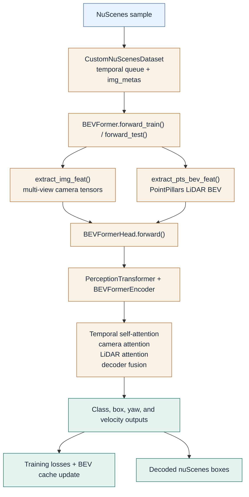

# Architecture

BEVFormerFusion is a BEVFormer-derived multi-modal detector that keeps the upstream camera-to-BEV scaffold and adds a PointPillars LiDAR branch, dual-stage fusion, and a dedicated motion head. The active method scope is defined by `projects/configs/bevformer/bevformer_project.py`, `projects/mmdet3d_plugin/bevformer/detectors/bevformer.py`, `projects/mmdet3d_plugin/bevformer/modules/transformer.py`, `projects/mmdet3d_plugin/bevformer/modules/encoder.py`, `projects/mmdet3d_plugin/bevformer/dense_heads/bevformer_head.py`, and `projects/mmdet3d_plugin/datasets/nuscenes_dataset.py`.

## Method summary

The detector starts from the standard BEVFormer camera path: multi-view images pass through ResNet-50 and FPN, BEV queries are updated by temporal self-attention, and camera spatial cross-attention lifts 2D features into the BEV grid. BEVFormerFusion then adds a LiDAR branch that voxelizes point clouds into PointPillars features, projects them into the BEV token space, and injects them twice: inside each encoder layer through a LiDAR deformable-attention branch and after the encoder through a concatenate-and-project block. The detection head separates box, yaw, and velocity supervision, with velocity predicted from the pre-fusion BEV snapshot rather than the fused decoder input.

```mermaid
flowchart LR
    accTitle: BEVFormerFusion Architecture Overview
    accDescr: Multi-view camera features and LiDAR point clouds are converted into BEV representations, fused inside the encoder and again before the decoder, and finally decoded into detection, orientation, and velocity outputs.

    camera["Multi-view images"]
    lidar["LiDAR point clouds"]
    backbone["ResNet-50 + FPN"]
    temporal["Temporal self-attention<br/>with prev_bev"]
    camera_cross["Camera spatial cross-attention"]
    pillars["PointPillars LiDAR BEV"]
    encoder_fusion["MM_BEVFormerLayer<br/>camera + LiDAR fusion"]
    camera_bev["Camera-path BEV snapshot<br/>bev_embed_cam"]
    decoder_fusion["Decoder fusion<br/>concat + project"]
    decoder["Detection transformer decoder"]
    box_heads["Class + box + yaw heads"]
    velocity_head["Dedicated velocity head"]

    camera --> backbone --> temporal --> camera_cross --> encoder_fusion
    lidar --> pillars --> encoder_fusion
    encoder_fusion --> camera_bev
    encoder_fusion --> decoder_fusion
    pillars --> decoder_fusion
    decoder_fusion --> decoder --> box_heads
    camera_bev --> velocity_head

    classDef input fill:#e7f1ff,stroke:#3d6aa2,color:#15263b
    classDef process fill:#f8f1e4,stroke:#bb6b2c,color:#15263b
    classDef fusion fill:#e5f4ef,stroke:#136f63,color:#15263b
    classDef output fill:#f3e8ff,stroke:#7c3aed,color:#15263b

    class camera,lidar input
    class backbone,temporal,camera_cross,pillars,decoder process
    class encoder_fusion,camera_bev,decoder_fusion fusion
    class box_heads,velocity_head output
```

<em>Figure: The active path preserves the BEVFormer camera scaffold, injects LiDAR BEV evidence in the encoder and decoder, and keeps velocity prediction attached to the pre-fusion camera BEV.</em>

## Active implementation scope

| Module | File path | Role |
| --- | --- | --- |
| Active config | `projects/configs/bevformer/bevformer_project.py` | Defines the published fusion model, data settings, losses, and training schedule. |
| Detector | `projects/mmdet3d_plugin/bevformer/detectors/bevformer.py` | Orchestrates image features, LiDAR BEV extraction, temporal cache handling, and train/test entry points. |
| Transformer | `projects/mmdet3d_plugin/bevformer/modules/transformer.py` | Builds BEV tokens, projects LiDAR BEV features, snapshots the pre-fusion BEV state, and runs decoder-side fusion. |
| Encoder | `projects/mmdet3d_plugin/bevformer/modules/encoder.py` | Implements `BEVFormerEncoder` and `MM_BEVFormerLayer`, including temporal self-attention, camera cross-attention, LiDAR cross-attention, and learned blending. |
| Head | `projects/mmdet3d_plugin/bevformer/dense_heads/bevformer_head.py` | Predicts classes, boxes, yaw bins, yaw residuals, and velocity; computes losses and assembles inference outputs. |
| Dataset | `projects/mmdet3d_plugin/datasets/nuscenes_dataset.py` | Builds temporal queues, enriches camera geometry metadata, and emits the `img_metas` structure used by the transformer. |

## Module-level explanation

### Camera path

The image branch is configured in `bevformer_project.py` with a ResNet-50 backbone and four-level FPN. `PerceptionTransformer.get_bev_features()` flattens the per-camera FPN maps, adds camera and level embeddings, computes ego-motion shift from `can_bus`, and passes the resulting tokens into `BEVFormerEncoder`.

### LiDAR path

`BEVFormer.extract_pts_bev_feat()` voxelizes point clouds and runs the PointPillars stack (`Voxelization`, `PillarFeatureNet`, `PointPillarsScatter`) to produce a LiDAR BEV feature map. `PerceptionTransformer` converts that map into BEV-space tokens through `lidar_encoder_proj` for encoder fusion and `lidar_proj` for decoder fusion.

### Encoder fusion

`MM_BEVFormerLayer` keeps the BEVFormer operation order `self_attn -> norm -> cross_attn -> norm -> ffn -> norm`, but its cross-attention stage is no longer camera-only. The camera path still uses `SpatialCrossAttention`, while a second `CustomMSDeformableAttention` branch reads `lidar_bev_tokens`. The two outputs are merged by `torch.sigmoid(self.cross_model_weights_logit)`.

### Decoder fusion

`PerceptionTransformer.forward()` clones `bev_embed` into `bev_embed_cam` before decoder-side fusion. It then interpolates and projects the LiDAR BEV map, normalizes it, scales it, concatenates it with the encoder output, and maps the `2C` tensor back to `C` with an identity-initialized linear layer. The decoder attends to this fused BEV, while the velocity head later attends to `bev_embed_cam`.

### Detection heads

`BEVFormerHead` keeps the BEVFormer class and box branches but adds:

- `yaw_bin_branches` for discrete yaw classification,
- `yaw_res_branches` for continuous residual refinement,
- `vel_cross_attn` plus `vel_branches` for dedicated velocity estimation.

The box loss explicitly zeros the yaw and velocity dimensions (`bbox_weights[:, 6:10] = 0`) so that orientation and motion supervision are isolated from the box regression path.

## Data flow

<em>Figure: The same multi-modal path is reused for training and inference; the branch-specific difference is whether the final predictions are consumed by the loss stack or the bbox decoder.</em>

## Training and inference flow

### Training

`BEVFormer.forward_pts_train()` retrieves `prev_bev` from the scene-keyed cache when available, builds the LiDAR BEV feature map, forwards both modalities through `BEVFormerHead`, updates the cache with the new `bev_embed`, and computes losses. `obtain_history_bev()` runs history frames in eval mode and without gradients, which reduces the memory burden of temporal context reconstruction.

### Inference

`BEVFormer.forward_test()` follows the same image and LiDAR feature flow, but carries temporal state through `prev_frame_info`. The decoder outputs and dedicated velocity predictions are passed into the NMS-free bbox coder, which overwrites the unsupervised velocity channels with the dedicated velocity-head output before returning final boxes.

## Paper-style abstract

BEVFormerFusion is a BEVFormer-derived detector that augments the camera-only BEV pipeline with PointPillars-based LiDAR features at two locations. The encoder replaces camera-only BEVFormer layers with multi-modal layers that blend camera and LiDAR deformable-attention outputs. The decoder receives an additional LiDAR shortcut through concatenate-and-project fusion, while a dedicated velocity head reads from the pre-fusion BEV snapshot to preserve temporal cues. The implementation therefore changes both representation learning and supervision without discarding the upstream BEVFormer detector path.

## Legacy and excluded paths

The repository contains additional code that is not treated as the public method path:

- `projects/configs/bevformerv2/` is a separate experiment family and is not used for the main documentation tables.
- `projects/mmdet3d_plugin/bevformer/modules/transformer copy.py` is a stale duplicate of the active transformer path.
- `projects/mmdet3d_plugin/bevformer/dense_heads/bevformer_head_old.py` is a retired head implementation.
- `tools/tests/test_petr3d_bevformer.py` imports `projects/mmdet3d_plugin/bevformer/modules/petr3d_embedding.py`, which does not exist in the repository and therefore cannot be treated as a passing validation path for the documented method.
