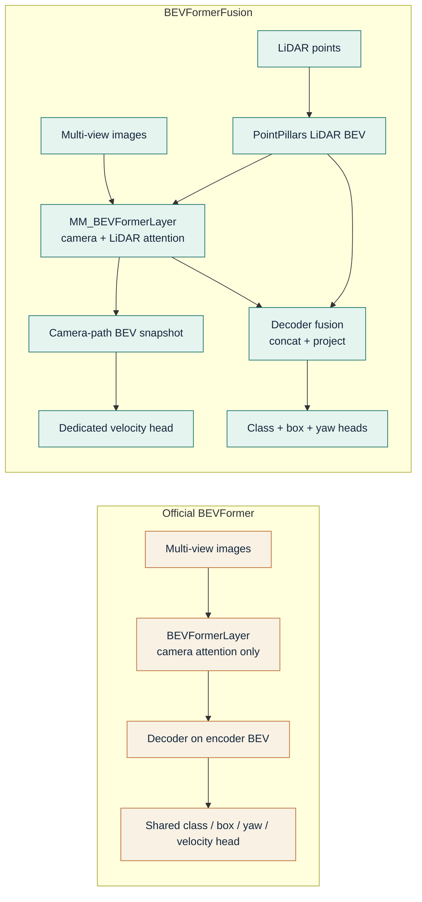

# BEVFormer Comparison

This comparison is restricted to two sources: the official `fundamentalvision/BEVFormer` implementation for the baseline and the active fusion path in this repository for the project column. The local `projects/configs/bevformer/bevformer_base.py` is used only as a sanity check that the in-repo baseline stays aligned with the upstream configuration.

## Baseline references

- Official repository: `https://github.com/fundamentalvision/BEVFormer`
- Baseline config: `projects/configs/bevformer/bevformer_base.py`
- Baseline transformer: `projects/mmdet3d_plugin/bevformer/modules/transformer.py`
- Baseline encoder: `projects/mmdet3d_plugin/bevformer/modules/encoder.py`
- Baseline head: `projects/mmdet3d_plugin/bevformer/dense_heads/bevformer_head.py`

## Core comparison

| Component | BEVFormer | This Project | Change Type | Technical Impact |
| --- | --- | --- | --- | --- |
| Sensor modality | Camera-only (`use_lidar=False`) | Camera + LiDAR (`use_lidar=True`) | Architectural addition | Introduces a second BEV feature path derived from PointPillars. |
| Camera backbone and preprocessing | ResNet-101 with DCNv2, Caffe-style normalization, `bev_h = bev_w = 200`, `num_query = 900` | ResNet-50 without DCNv2, PyTorch-style normalization, `bev_h = bev_w = 100`, `num_query = 450` | Training and config change | Shrinks the local token/query budget and backbone depth relative to the local base config. |
| LiDAR branch | None in the published base path | PointPillars voxelization, pillar encoding, and scatter-to-BEV pipeline | Architectural addition | Produces a LiDAR BEV map that can be fused directly in BEV space. |
| Encoder layer class | `BEVFormerLayer` | `MM_BEVFormerLayer` | Architectural modification | Replaces camera-only encoder cross-attention with a multi-modal encoder layer. |
| Encoder cross-attention | Camera `SpatialCrossAttention` only | Camera `SpatialCrossAttention` plus LiDAR `CustomMSDeformableAttention` with learned sigmoid blending | Architectural modification | Enables per-layer fusion between image-lifted BEV evidence and LiDAR BEV evidence. |
| Decoder input | Encoder BEV only | Encoder BEV concatenated with projected LiDAR BEV and compressed by `lidar_fuse_linear` | Architectural addition | Adds a direct LiDAR shortcut to the decoder in addition to the encoder fusion path. |
| Decoder fusion initialization | Not applicable | Identity-initialized camera passthrough with zero LiDAR half | Efficiency and memory change | Starts training from the camera-only decoder path and learns LiDAR contribution incrementally. |
| Yaw supervision | Direct box regression channels | Separate yaw-bin and yaw-residual heads | Architectural modification | Splits coarse orientation selection from residual refinement. |
| Velocity supervision | Velocity predicted in the box regression branch | Dedicated velocity cross-attention head on `bev_embed_cam`; box velocity weights zeroed | Architectural modification | Decouples motion estimation from the LiDAR-heavy decoder representation. |
| Temporal history execution | Standard `prev_bev` path | `obtain_history_bev()` runs history in eval mode with no gradients and caches by scene key | Efficiency and memory change | Avoids backpropagating through history frames while preserving temporal context. |

<em>Figure: The comparison diagram isolates the method-level differences behind the table: LiDAR enters only in the fusion path, affects both encoder and decoder BEV representations, and leaves motion estimation on a separate camera-path branch.</em>

## New modules and modified attention paths

### New modules

- `pts_voxel_layer`, `pts_voxel_encoder`, and `pts_middle_encoder` in the active config add the PointPillars LiDAR encoder path.
- `lidar_encoder_proj`, `lidar_proj`, `lidar_fuse_linear`, and `lidar_fuse_norm` in `PerceptionTransformer` implement the two LiDAR fusion stages.
- `yaw_bin_branches`, `yaw_res_branches`, `vel_cross_attn`, and `vel_branches` in `BEVFormerHead` implement dedicated orientation and motion heads.

### Modified attention

- Encoder cross-attention now has two branches in `MM_BEVFormerLayer`: `SpatialCrossAttention` for camera features and `lidar_cross_attn_layer` for LiDAR BEV tokens.
- Velocity estimation uses full `nn.MultiheadAttention` from decoder queries to the pre-fusion BEV snapshot rather than reusing the box branch output.

### Efficiency and memory-oriented changes

- The active config halves the BEV grid resolution per side and the query count relative to the local base config.
- The active config reduces encoder depth from 6 to 4 layers.
- History BEV reconstruction is explicitly run without gradients in `BEVFormer.obtain_history_bev()`.

## Comparison notes

1. The official BEVFormer code already includes temporal BEV handling and NMS-free decoding. Those paths are retained rather than replaced.
2. The project changes mix architectural and configuration differences. The table labels them separately so that implementation changes are not conflated with local compute-budget reductions.
3. Runtime benefits are not claimed quantitatively because the repository does not contain a benchmark artifact for FPS or memory. Only structural compute reductions, such as smaller grids and fewer queries, are described here.
