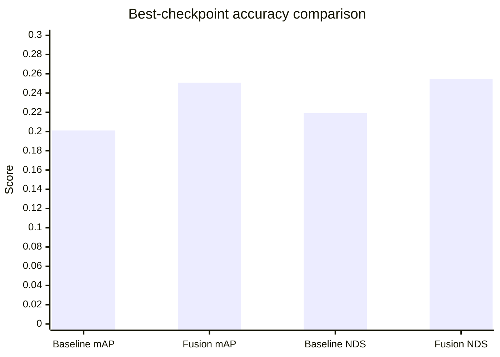
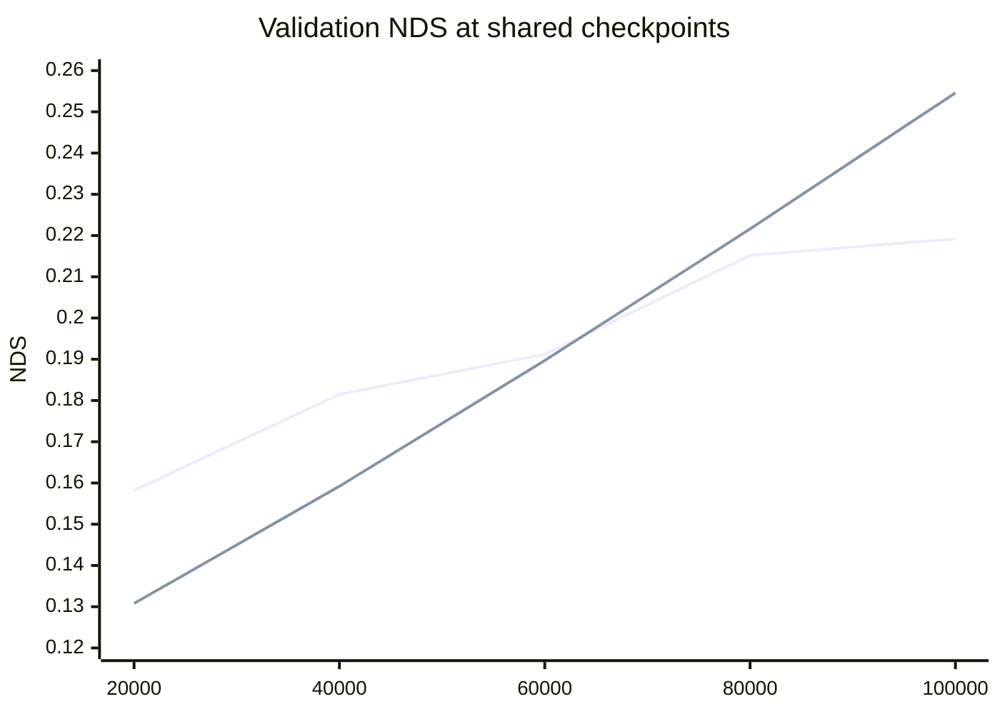

# Experiments

This page publishes only repository-tracked checkpoint evidence normalized into `docs/assets/data/metrics.json`. The tables below therefore report the recorded validation metrics for the baseline and fusion runs represented by that artifact.

## Experiment summary

The active fusion path is trained with `projects/configs/bevformer/bevformer_project.py`, which defines a `100 x 100` BEV grid, `450` object queries, a four-layer encoder, a six-layer decoder, AdamW with `lr = 2e-4`, and `fusion_mode = encoder_decoder`. The local baseline curve was normalized from `results/Baseline_Results_Summary.xlsx`, while the fused-model curve was normalized from `results/Enc_Dec_Results_Summary.xlsx`. `results/EncoderFusion_Results_SHS.xlsx` was byte-identical to the fused workbook and is therefore treated as a duplicate artifact rather than a second experiment.

## Main results

| Model | Config | Best iter | mAP | NDS |
| --- | --- | ---: | ---: | ---: |
| Local BEVFormer baseline | `projects/configs/bevformer/bevformer_base.py` | 100000 | 0.2011 | 0.2192 |
| BEVFormerFusion | `projects/configs/bevformer/bevformer_project.py` | 100000 | 0.2507 | 0.2546 |

<em>Figure: The best recorded checkpoint improves both published accuracy metrics, with the fused run exceeding the local baseline in mAP and NDS.</em>

## Checkpoint progression

### Local baseline curve

| Iter | mAP | NDS | mATE | mAOE | mAVE |
| ---: | ---: | ---: | ---: | ---: | ---: |
| 10000 | 0.0925 | 0.1336 | 1.1162 | 1.2415 | 1.1255 |
| 20000 | 0.1470 | 0.1582 | 1.0150 | 1.0189 | 1.2113 |
| 30000 | 0.1552 | 0.1661 | 1.0017 | 0.9718 | 1.2108 |
| 40000 | 0.1730 | 0.1815 | 1.0060 | 0.9187 | 1.2434 |
| 50000 | 0.1824 | 0.1859 | 0.9909 | 0.9784 | 1.1701 |
| 60000 | 0.1869 | 0.1912 | 1.0138 | 0.9268 | 1.1669 |
| 70000 | 0.2019 | 0.2153 | 0.9491 | 0.8435 | 1.0882 |
| 80000 | 0.1915 | 0.2152 | 0.9632 | 0.7844 | 1.0605 |
| 90000 | 0.1973 | 0.2185 | 0.9535 | 0.7891 | 1.0675 |
| 100000 | 0.2011 | 0.2192 | 0.9490 | 0.8150 | 1.0415 |

### Fusion curve

| Iter | mAP | NDS | mATE | mAOE | mAVE |
| ---: | ---: | ---: | ---: | ---: | ---: |
| 20000 | 0.0898 | 0.1308 | 1.0949 | 1.1403 | 1.2492 |
| 40000 | 0.1271 | 0.1592 | 1.0232 | 1.0656 | 1.1028 |
| 60000 | 0.1785 | 0.1897 | 0.9835 | 1.0142 | 1.1361 |
| 80000 | 0.2066 | 0.2216 | 0.9197 | 0.8671 | 1.0771 |
| 100000 | 0.2507 | 0.2546 | 0.8697 | 0.8241 | 1.1375 |

<em>Figure: Line order is local baseline first, then BEVFormerFusion. The fused run starts lower at early checkpoints and finishes above the baseline at the shared 100k endpoint.</em>

## Analysis

The best fused checkpoint at 100k iterations improves the local baseline by `+0.0496` mAP and `+0.0354` NDS. The same checkpoint also lowers mATE from `0.9490` to `0.8697` and lowers mAAE from `0.3333` to `0.2963`.

The fused curve starts below the baseline at early checkpoints and overtakes the baseline by 80k iterations. That pattern is visible directly in the normalized curves and is therefore reported here without attributing a causal explanation beyond the architectural changes documented elsewhere.

## Setup

| Item | Value |
| --- | --- |
| Dataset | nuScenes with temporal train/val info files |
| Active config | `projects/configs/bevformer/bevformer_project.py` |
| BEV resolution | `100 x 100` |
| Object queries | `450` |
| Encoder / decoder layers | `4 / 6` |
| Queue length | `4` |
| Optimizer | AdamW |
| Learning rate | `2e-4` |
| Weight decay | `0.01` |
| Backbone LR multiplier | `0.1` |
| Fusion mode | `encoder_decoder` |
